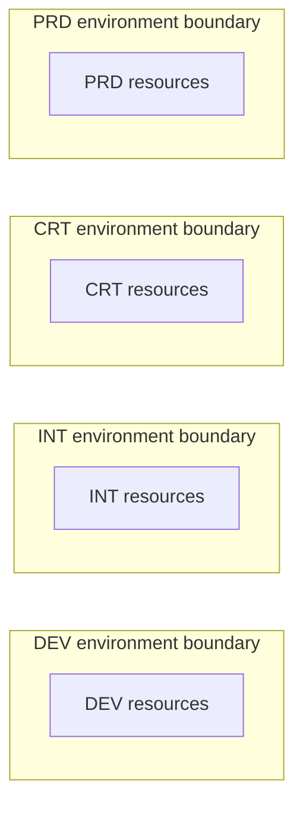

# Environment Isolation

**Status:** User-confirmed environment model and isolation boundary. Enforcement and deployed topology have not been verified.

**Source:** Environment details supplied by the user on 2026-09-03.

**Owner:** Not yet supplied.

## Customer Outcome

Our Azure platform has four environments: **DEV**, **INT**, **CRT**, and **PRD**. The environments are not cross-connected.

Application and platform designs must not depend on direct network connectivity between these environment boundaries. The full environment names, intended lifecycle use, subscription mapping, regions, and promotion process remain to be documented.

## Confirmed Environment Boundaries

| Environment | Confirmed connectivity boundary |
| --- | --- |
| DEV | No cross-connection to INT, CRT, or PRD |
| INT | No cross-connection to DEV, CRT, or PRD |
| CRT | No cross-connection to DEV, INT, or PRD |
| PRD | No cross-connection to DEV, INT, or CRT |

In this standard, a cross-connection means direct network connectivity between different environment boundaries. The exact controls that enforce the separation have not been supplied.

## Logical Isolation View

The absence of arrows between the four boundaries is intentional: the environments are not cross-connected. The diagram does not define subscriptions, VNets, hubs, routes, firewalls, shared services, DNS paths, or application flows inside an environment.

## Design Implications

- Deploy environment-specific dependencies inside the environment that consumes them.
- Do not use a direct network path to make one environment depend on a service in another environment.
- Do not add cross-environment VNet peering, routing, Private Endpoint consumption, or other connectivity as an undocumented workaround.
- Treat artifact promotion, data movement, and shared service consumption as separate design concerns. Approved patterns for those concerns remain to be documented.
- Apply the [production change requirement](../governance/production-change-management.md) to every production-impacting change.

## Details to Document

| Area | Details still needed |
| --- | --- |
| Environment definitions | Full names, purpose, entry and exit criteria, and permitted workload types for DEV, INT, CRT, and PRD |
| Azure organization | Management groups, subscriptions, resource groups, regions, and naming conventions for each environment |
| Network enforcement | VNets, hubs, route controls, firewall boundaries, policy controls, and evidence that environments are not cross-connected |
| Shared services | Which services, if any, are shared without creating direct environment-to-environment connectivity |
| Promotion | Approved movement of code, artifacts, configuration, and data between lifecycle stages |
| Ownership | Architecture owner, environment owners, request path, support contacts, and exception authority |

The entries above are documentation gaps, not deployed configuration or approved procedures.

## Related Documentation

- [Architecture](README.md)
- [Hub-and-Spoke Network](hub-and-spoke-network.md)
- [Private Endpoints](../networking/private-endpoints.md)
- [Production Change Management](../governance/production-change-management.md)
- [Terraform Platform](../infrastructure-as-code/terraform-platform.md)
- [Troubleshooting](../troubleshooting/README.md)

[Home](../Home.md)
