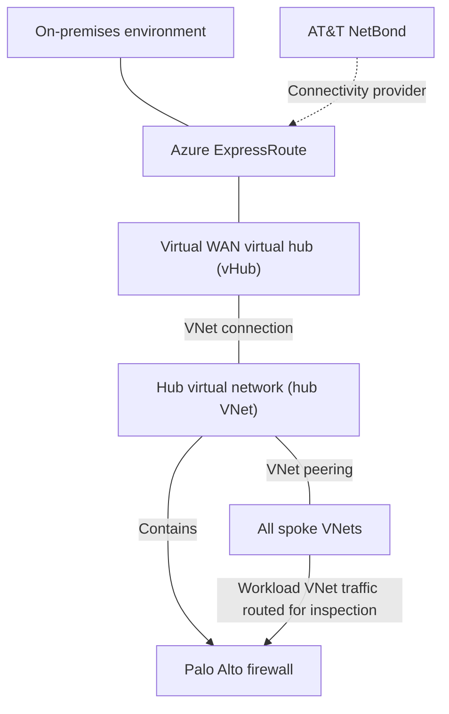
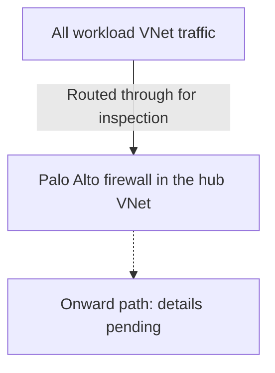

# Hub-and-Spoke Network

**Status:** Recorded architecture baseline. Detailed configuration and operational validation are pending.

**Source:** Platform descriptions and clarifications supplied by the user on 2026-08-31 and 2026-09-03.

## Confirmed Architecture

Our Azure network combines Azure Virtual WAN with a hub-and-spoke VNet topology. We use AT&T NetBond for our ExpressRoute connections. ExpressRoute connects to a virtual hub (vHub) in our Virtual WAN. The vHub has a VNet connection to the hub virtual network (hub VNet), which contains the Palo Alto firewall and is VNet peered to all spokes.

**All workload VNet traffic is routed through and inspected by the Palo Alto firewall.**

| Component or scope | Confirmed role |
| --- | --- |
| Network topology | Azure Virtual WAN connected to a hub-and-spoke VNet topology |
| ExpressRoute connectivity provider | AT&T NetBond |
| ExpressRoute | Connects to the vHub in our Virtual WAN for on-premises access |
| Virtual WAN vHub | Has a VNet connection to the hub VNet |
| Hub VNet | Transit network that contains the Palo Alto firewall |
| Spoke connectivity | The hub VNet is VNet peered to all spokes |
| Palo Alto firewall | Located in the hub VNet and provides routing and traffic inspection |
| Traffic scope | All workload VNet traffic |
| Firewall and rule management | Cyber Defense Engineering team |

AT&T NetBond is the confirmed provider for our ExpressRoute connections. The **Virtual WAN vHub** and **hub VNet** are separate components. The vHub provides the confirmed ExpressRoute attachment relationship and connects to the hub VNet. The hub VNet provides shared transit to the VNet-peered spokes, and its Palo Alto firewall provides the routing and inspection point for workload VNet traffic. The additional business and design rationale has not yet been captured.

## Logical Topology

The solid undirected lines show confirmed network connections. The dashed arrow identifies AT&T NetBond as the ExpressRoute connectivity provider rather than presenting it as a packet hop or support boundary. The solid directional arrows show containment and the confirmed workload-routing requirement. **All spoke VNets** is a scope statement, not a resource inventory. The diagram does not infer gateway resource types, BGP settings, route tables, addresses, resiliency, or return-path behavior.

## Workload VNet Traffic Routing and Inspection

The diagram summarizes the confirmed routing and inspection model for all workload VNet traffic. For traffic egressing a workload spoke, the Palo Alto firewall is the first hop. Detailed destination paths and inspection configuration still need to be documented and validated.

The firewall's placement in the hub VNet is confirmed. Its specific Palo Alto product, deployment model, forwarding endpoint, and high-availability configuration have not been confirmed. The dashed path represents destination-specific onward routing that still needs documentation.

## Firewall Management

The **Cyber Defense Engineering** team is responsible for managing the **Palo Alto firewall and its rules**.

This responsibility is confirmed by the user. Team contact details, firewall and rule-change request channels, approval responsibilities, and escalation procedures remain to be documented. This statement does not assign responsibility for other network services or the overall security policy.

## Guidance for Consuming Teams

Use the Palo Alto routing and inspection model as the baseline when describing workload VNet connectivity. The hub's transit role does not by itself document which destinations are permitted; firewall rules, supported flows, and the connectivity request process still need to be supplied.

For a concise answer to common questions, see the [networking FAQ](../faq/README.md#networking).

## On-Premises Connectivity

We use [ExpressRoute](../networking/expressroute-connectivity.md) through AT&T NetBond for access to the on-premises environment. ExpressRoute connects to the Virtual WAN vHub, and that vHub has a VNet connection to the hub VNet. The specific NetBond service configuration, circuits, gateway resources, peerings, route propagation, and end-to-end forward and return paths remain to be documented.

The platform follows a [Zero Trust policy](../security/zero-trust-policy.md). Connectivity does not by itself establish which application flows or access requests are approved.

## Implementation Details to Confirm

| Area | Information needed |
| --- | --- |
| Network inventory | Virtual WAN, vHub, hub VNet, spoke VNet, ExpressRoute, gateway, connection, subscription, region, subnet, and address-space inventory |
| AT&T NetBond | Service configuration, ExpressRoute circuit mapping, redundancy, support ownership, and escalation path |
| Connectivity configuration | vHub-to-hub-VNet connection and hub-VNet-to-spoke peering names, settings, status, and resiliency |
| Firewall deployment | Palo Alto product, subnet and forwarding endpoints, instance count, availability design, and failover behavior |
| Routing | VNet and vHub route tables, route propagation, user-defined routes, next-hop values, BGP configuration, and workload subnet coverage |
| Inspection | Applied inspection policies and features, and any decryption configuration |
| Destination paths | Onward paths to applicable destinations, such as other spokes, the internet, on-premises networks, or private services |
| Return traffic and NAT | Return-path routing and any address translation performed |
| Policy and operations | Approved flows, any confirmed exceptions, logging, monitoring, contact details, and change procedures |

These details must come from platform records or owner confirmation. This page does not provide deployment commands or an executable operational procedure.

## Related Documentation

- [Architecture](README.md)
- [Networking](../networking/README.md)
- [Private DNS Zone Management](../networking/private-dns-zone-management.md)
- [Using Azure](../using-azure/README.md)
- [FAQ](../faq/README.md)

[Home](../Home.md)
