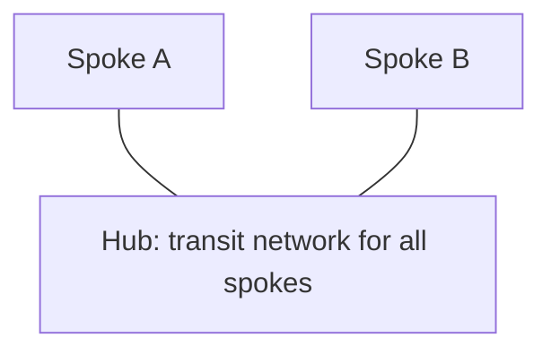
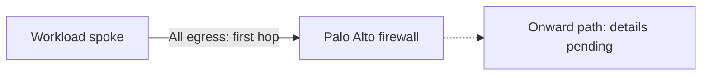

# Hub-and-Spoke Network

**Status:** Recorded architecture baseline. Detailed configuration and operational validation are pending.

**Source:** Platform description supplied by the user on 2026-08-31.

## Confirmed Architecture

Our Azure network uses a hub-and-spoke topology. The hub is the transit network for all spokes. A Palo Alto firewall is the first hop for all traffic egressing the workload spokes.

| Component or scope | Confirmed role |
| --- | --- |
| Network topology | Hub and spoke |
| Hub | Transit network for all spokes |
| Palo Alto firewall | First hop for traffic leaving workload spokes |
| Egress scope | All traffic egressing workload spokes, not only internet-bound traffic |

The hub provides the shared transit role, and the firewall provides a common first hop for workload-spoke egress. The additional business and design rationale has not yet been captured.

## Logical Topology

Spoke A and Spoke B are illustrative labels, not an inventory. These connections show logical relationships; the hub resource type and spoke connection mechanism have not yet been documented.

## Workload-Spoke Egress

The first-hop statement applies to traffic leaving a workload spoke. It does not establish the path for traffic staying within a spoke, traffic entering a spoke, or return traffic.

The firewall is shown separately to describe its role in the flow. Its physical placement, deployment product, and forwarding endpoint have not been confirmed. The dashed path represents onward routing that still needs documentation.

## Guidance for Consuming Teams

Use the Palo Alto first-hop path as the baseline when describing outbound workload connectivity. The hub's transit role does not by itself document which destinations are permitted; firewall rules, supported flows, and the connectivity request process still need to be supplied.

For a concise answer to common questions, see the [networking FAQ](../faq/README.md#networking).

## Implementation Details to Confirm

| Area | Information needed |
| --- | --- |
| Network inventory | Hub and spoke resource types, connection mechanism, subscriptions, regions, subnets, and address spaces |
| Firewall deployment | Palo Alto product, location, instance count, availability design, and failover behavior |
| Routing | How the firewall is selected as the first hop, next-hop values, route configuration, and workload subnet coverage |
| Destination paths | Onward paths to applicable destinations, such as other spokes, the internet, on-premises networks, or private services |
| Return traffic and NAT | Return-path routing and any address translation performed |
| Policy and operations | Approved flows, any confirmed exceptions, logging, monitoring, ownership, and change procedures |

These details must come from platform records or owner confirmation. This page does not provide deployment commands or an executable operational procedure.

## Related Documentation

- [Architecture](README.md)
- [Networking](../networking/README.md)
- [Private DNS Zone Management](../networking/private-dns-zone-management.md)
- [Using Azure](../using-azure/README.md)
- [FAQ](../faq/README.md)

[Home](../Home.md)
