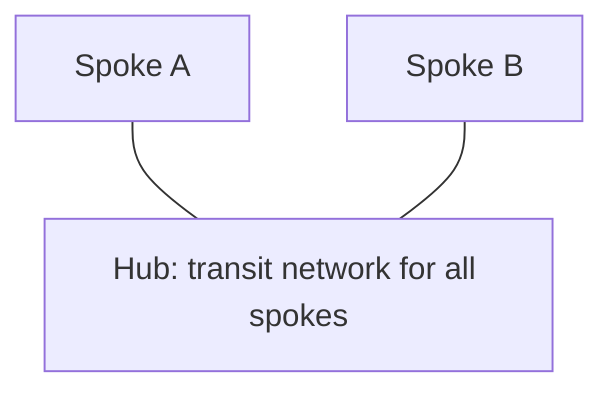
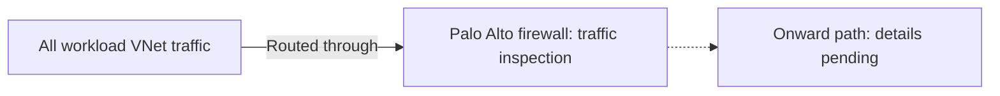

# Hub-and-Spoke Network

**Status:** Recorded architecture baseline. Detailed configuration and operational validation are pending.

**Source:** Platform descriptions and clarifications supplied by the user on 2026-08-31.

## Confirmed Architecture

Our Azure network uses a hub-and-spoke topology. The hub is the transit network for all spokes.

**All workload VNet traffic is routed through and inspected by the Palo Alto firewall.**

| Component or scope | Confirmed role |
| --- | --- |
| Network topology | Hub and spoke |
| Hub | Transit network for all spokes |
| Palo Alto firewall | Routing and traffic inspection |
| Traffic scope | All workload VNet traffic |
| Firewall and rule management | Cyber Defense Engineering team |

The hub provides shared transit, and the firewall provides the routing and inspection point for workload VNet traffic. The additional business and design rationale has not yet been captured.

## Logical Topology

Spoke A and Spoke B are illustrative labels, not an inventory. These connections show logical relationships; the hub resource type and spoke connection mechanism have not yet been documented.

## Workload VNet Traffic Routing and Inspection

The diagram summarizes the confirmed routing and inspection model for all workload VNet traffic, rather than only traffic leaving a spoke. Detailed paths and inspection configuration still need to be documented and validated.

The firewall is shown separately to describe its role in the flow. Its physical placement, deployment product, and forwarding endpoint have not been confirmed. The dashed path represents onward routing that still needs documentation.

## Firewall Management

The **Cyber Defense Engineering** team is responsible for managing the **Palo Alto firewall and its rules**.

This responsibility is confirmed by the user. Team contact details, firewall and rule-change request channels, approval responsibilities, and escalation procedures remain to be documented. This statement does not assign responsibility for other network services or the overall security policy.

## Guidance for Consuming Teams

Use the Palo Alto routing and inspection model as the baseline when describing workload VNet connectivity. The hub's transit role does not by itself document which destinations are permitted; firewall rules, supported flows, and the connectivity request process still need to be supplied.

For a concise answer to common questions, see the [networking FAQ](../faq/README.md#networking).

## On-Premises Connectivity

We use [ExpressRoute](../networking/expressroute-connectivity.md) for access to the on-premises environment. The specific circuit attachment, gateway placement, and end-to-end routing path remain to be documented.

The platform follows a [Zero Trust policy](../security/zero-trust-policy.md). Connectivity does not by itself establish which application flows or access requests are approved.

## Implementation Details to Confirm

| Area | Information needed |
| --- | --- |
| Network inventory | Hub and spoke resource types, connection mechanism, subscriptions, regions, subnets, and address spaces |
| Firewall deployment | Palo Alto product, location, instance count, availability design, and failover behavior |
| Routing | Route configuration, next-hop values, and workload subnet coverage that direct workload VNet traffic through Palo Alto |
| Inspection | Applied inspection policies and features, and any decryption configuration |
| Destination paths | Onward paths to applicable destinations, such as other spokes, the internet, on-premises networks, or private services |
| Return traffic and NAT | Return-path routing and any address translation performed |
| Policy and operations | Approved flows, any confirmed exceptions, logging, monitoring, contact details, and change procedures |

These details must come from platform records or owner confirmation. This page does not provide deployment commands or an executable operational procedure.

## Related Documentation

- [Architecture](README.md)
- [Networking](../networking/README.md)
- [Private DNS Zone Management](../networking/private-dns-zone-management.md)
- [Using Azure](../using-azure/README.md)
- [FAQ](../faq/README.md)

[Home](../Home.md)
