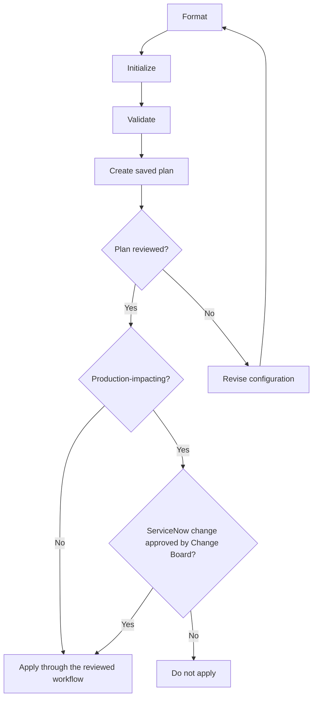

# Terraform Command Cheat Sheet

**Status:** General reference. Repository-specific workflows, approvals, and recovery procedures are pending review.

**Audience:** Engineers who develop, review, or operate Terraform configurations.

**Owner:** To be confirmed.

**Last reviewed:** 2026-09-03.

Terraform in this organization uses reusable modules built by the Cloud Platform team and published to Artifactory, Azure Storage Accounts for state, and GitHub Actions for workflows. Use the versions pinned by the repository and follow its reviewed workflow. DEV, INT, CRT, and PRD are not cross-connected, so confirm the target environment and state before every plan.

> A saved Terraform plan can contain sensitive values. Store it only as a protected, short-lived artifact and never commit it.

## Command Pattern

These examples use Terraform's `-chdir` global option so commands can run from outside a root module.

```bash
terraform -chdir=<root-module> <command>
```

Run `terraform <command> -help` to inspect the options supported by the installed Terraform version.

## Inspect the Installation

**Read-only**

```bash
terraform version
terraform -help
terraform plan -help
```

## Standard Review Workflow



The diagram summarizes the routine command sequence and production approval gate. Formatting changes local files, initialization prepares the working directory and backend, planning creates a sensitive review artifact, and applying through the reviewed workflow can change Azure resources and Terraform state.

### Format

**Local change:** The first command rewrites Terraform files. The second only checks formatting.

```bash
terraform -chdir=<root-module> fmt -recursive
terraform -chdir=<root-module> fmt -check -recursive -diff
```

### Initialize

**Local change:** Downloads modules and providers and initializes the configured backend. Backend authentication must use the approved identity method; do not put storage keys or secrets in `backend.hcl`.

```bash
terraform -chdir=<root-module> init -backend-config=backend.hcl
```

When the repository already contains a reviewed dependency lock file, CI can prevent unexpected lock-file changes:

```bash
terraform -chdir=<root-module> init \
  -backend-config=backend.hcl \
  -input=false \
  -lockfile=readonly
```

Do not use `-upgrade` as part of a routine deployment. Upgrade providers and modules in a separate reviewed change.

### Validate

**Read-only**

```bash
terraform -chdir=<root-module> validate
```

### Create and Review a Plan

**Read-only against configuration, but may refresh remote state information.** Protect the generated plan as sensitive.

```bash
terraform -chdir=<root-module> plan \
  -var-file=<environment>.tfvars \
  -out=tfplan

terraform -chdir=<root-module> show tfplan
```

Review the resource scope, replacements, deletions, security settings, role assignments, private endpoints, and outputs before approval.

### Apply the Reviewed Plan

**Azure change and Terraform state change**

```bash
terraform -chdir=<root-module> apply tfplan
```

Apply the exact reviewed plan. Do not substitute a new implicit plan at deployment time.

## Variables

Pass non-secret environment values through a protected variable file:

```bash
terraform -chdir=<root-module> plan \
  -var-file=<environment>.tfvars \
  -out=tfplan
```

Pass a sensitive value through a protected automation secret or an environment variable rather than committing it:

```bash
export TF_VAR_<variable_name>='<sensitive-value>'
terraform -chdir=<root-module> plan -var-file=<environment>.tfvars -out=tfplan
unset TF_VAR_<variable_name>
```

Do not enable shell tracing while handling secrets. Environment variables can still be exposed to local processes or diagnostic tooling, so use the approved secret-delivery mechanism for the target workflow.

## Inspect Configuration and State

**Read-only:** State output can contain sensitive information.

```bash
terraform -chdir=<root-module> providers
terraform -chdir=<root-module> state list
terraform -chdir=<root-module> state show '<resource-address>'
terraform -chdir=<root-module> output
terraform -chdir=<root-module> output -raw <output-name>
```

Do not paste state or unreviewed output into issues, chat, logs, or documentation.

## Check for Drift

**Read-only plan:** This proposes state-only reconciliation and does not repair infrastructure.

```bash
terraform -chdir=<root-module> plan \
  -refresh-only \
  -var-file=<environment>.tfvars \
  -out=refresh.tfplan
```

Applying a refresh-only plan changes Terraform state and requires the same review and approval as another state operation.

## Import an Existing Resource

**Terraform state change**

```bash
terraform -chdir=<root-module> import \
  -var-file=<environment>.tfvars \
  '<resource-address>' \
  '<azure-resource-id>'
```

Define and review the matching Terraform configuration first. Confirm the provider's import identifier format and create a backup or recovery point under the approved state procedure before importing.

## Plan a Destructive Change

**Potentially destructive:** This creates a proposed destruction plan. Applying that plan deletes managed infrastructure.

```bash
terraform -chdir=<root-module> plan \
  -destroy \
  -var-file=<environment>.tfvars \
  -out=destroy.tfplan
```

Do not apply a destruction plan without explicit approval, dependency review, recovery validation, and the required change process.

## Troubleshooting Checks

**Read-only or local change, depending on the command**

```bash
terraform -chdir=<root-module> validate -json
terraform -chdir=<root-module> providers
terraform -chdir=<root-module> state list
terraform -chdir=<root-module> output
```

Before retrying a failed operation, determine whether Azure resources or Terraform state changed. Do not immediately rerun `apply` after an interrupted deployment.

## Commands Requiring a Runbook

Do not normalize these actions through a general cheat sheet:

- `terraform force-unlock`
- direct `terraform state rm`, `state mv`, or `state push`
- targeted plans or applies using `-target`
- routine use of `-auto-approve`
- applying an unreviewed destruction plan
- manually editing or replacing remote state

These operations need a documented reason, impact analysis, backup or recovery method, validation, and approval path.

## Official References

- [Terraform CLI overview](https://developer.hashicorp.com/terraform/cli/commands)
- [`terraform init`](https://developer.hashicorp.com/terraform/cli/commands/init)
- [`terraform plan`](https://developer.hashicorp.com/terraform/cli/commands/plan)
- [`terraform apply`](https://developer.hashicorp.com/terraform/cli/commands/apply)
- [`terraform fmt`](https://developer.hashicorp.com/terraform/cli/commands/fmt)
- [`terraform validate`](https://developer.hashicorp.com/terraform/cli/commands/validate)

[Command Cheat Sheets](README.md) | [Terraform Platform](../infrastructure-as-code/terraform-platform.md) | [Validate a Terraform Change](../runbooks/validate-terraform-change.md) | [Home](../Home.md)
