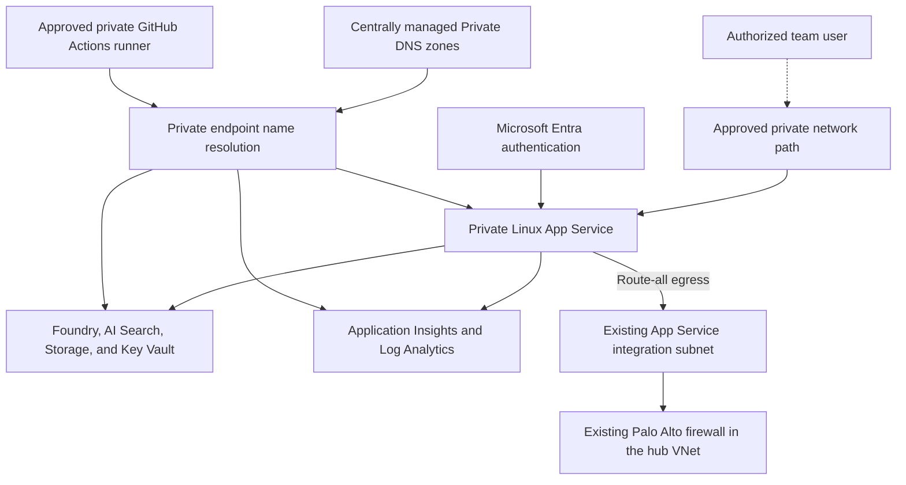
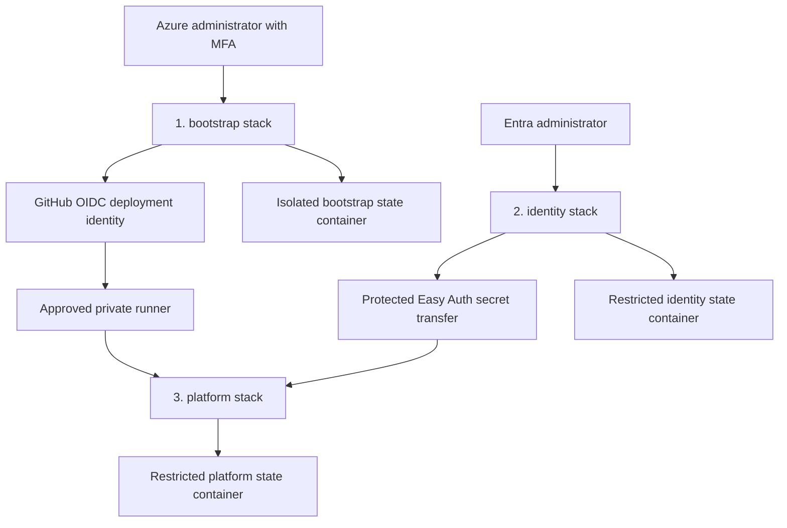

# Azure Wiki Assistant Deployment

This package provisions the Azure application platform for a private, team-facing assistant that can use the Cloud Platform Wiki as grounded content. It is an implementation template: no Azure resources are deployed merely by adding these files to the repository.

The deployment assumes the organization already provides the Azure subscriptions and connected network topology: ExpressRoute through AT&T NetBond to a Virtual WAN vHub, a VNet connection from that vHub to the hub VNet, the Palo Alto firewall in the hub VNet, VNet peering from the hub VNet to all spokes, and centrally managed private DNS zones.

## Scope

Terraform creates:

- A dedicated resource group, if requested
- A GitHub Actions deployment identity with workload identity federation
- A single-tenant Microsoft Entra application, enterprise application, roles, and assignments
- A Microsoft Foundry resource, project, and explicit chat and embedding model deployments
- Azure AI Search with a hybrid vector and semantic index
- A private Azure Storage account and content container
- A private, purge-protected Azure Key Vault
- A Linux App Service plan and private Linux web app
- User-assigned identities for the app runtime, application deployment, and content synchronization
- Least-privilege Azure role assignments for those identities
- Private endpoints for App Service, Foundry, Search, Blob Storage, Key Vault, and Azure Monitor
- Log Analytics, Application Insights, and Azure diagnostic settings

Terraform does not create or change:

- Hub or spoke virtual networks
- VNet peering, Virtual WAN, route tables, or user-defined routes
- Palo Alto firewalls, policies, or rules
- AT&T NetBond services or Azure ExpressRoute circuits, gateways, peerings, or connections
- Private DNS zones or VNet links
- Azure Policy assignments or public-access exemptions
- Dynatrace environments, agents, credentials, or integrations
- The assistant application or Wiki ingestion program

Public network access remains disabled for every supported application resource. This template has no public-access exception switch.

## Logical Deployment Architecture



The diagram shows the intended logical boundaries of the Terraform package. The dashed user path is deliberately unspecified because the end-user network path has not been supplied. Terraform creates the private application services and endpoints but consumes the existing subnets, routing, firewall path, Virtual WAN and VNet connectivity, ExpressRoute through AT&T NetBond, and centrally managed Private DNS zones.

## Existing Network Contract

Provide two existing subnet resource IDs:

| Input | Existing subnet requirement |
| --- | --- |
| `app_service_integration_subnet_id` | Dedicated and delegated for App Service regional VNet integration |
| `private_endpoint_subnet_id` | Allows private endpoints and has available addresses |

The organization-level network relationships consumed by this package are:

- The existing ExpressRoute connections use AT&T NetBond.
- ExpressRoute connects to a vHub in the existing Virtual WAN.
- The vHub has an existing VNet connection to the hub VNet.
- The hub VNet contains the Palo Alto firewall.
- The hub VNet has existing VNet peering to all spokes.

The existing route table on the integration subnet remains responsible for routing workload egress through the Palo Alto firewall in the hub VNet. The template enables App Service route-all behavior but does not create or modify AT&T NetBond service, ExpressRoute, Virtual WAN resources, VNet connections, VNet peerings, routes, or firewall configuration.

Any required outbound destinations must be allowed by the existing Palo Alto policy. The Cyber Defense Engineering team remains responsible for firewall administration and rule review; this template does not assume or create a request path that has not been documented.

The GitHub runner that applies `platform/` must be able to resolve and reach the private Key Vault and Search endpoints. A GitHub-hosted runner is not sufficient after public access is disabled. Use an approved self-hosted runner in, or connected to, the existing network.

## Central Private DNS Contract

The Cloud Platform Solutions and Services team continues to own the zones and VNet links. The platform stack only associates private endpoints with supplied zone IDs when `manage_private_dns_zone_groups` is `true`.

| Input key | Required existing zone |
| --- | --- |
| `app_service` | `privatelink.azurewebsites.net` |
| `blob` | `privatelink.blob.core.windows.net` |
| `key_vault` | `privatelink.vaultcore.azure.net` |
| `search` | `privatelink.search.windows.net` |
| `foundry_cognitive_services` | `privatelink.cognitiveservices.azure.com` |
| `foundry_openai` | `privatelink.openai.azure.com` |
| `foundry_ai_services` | `privatelink.services.ai.azure.com` |
| `azure_monitor` | `privatelink.monitor.azure.com` |
| `log_analytics_oms` | `privatelink.oms.opinsights.azure.com` |
| `log_analytics_ods` | `privatelink.ods.opinsights.azure.com` |
| `automation_agentsvc` | `privatelink.agentsvc.azure-automation.net` |

If central DNS does not permit automatic zone-group association, set `manage_private_dns_zone_groups = false` and coordinate a staged rollout. Service private endpoints must exist before their addresses can be registered; Key Vault and Search data-plane resources cannot be completed until those names resolve privately. The App Service private endpoint record is registered after the web app can be created. Do not expect a single full apply to complete in manual-DNS mode.

Azure Monitor Private Link uses multiple addresses and shared monitoring DNS names. The central DNS and monitoring owners must review that association and confirm sufficient private-endpoint subnet capacity before deployment.

## Stacks

Apply the stacks in this order. Each stack has a separate Azure Storage state key and should use a separate state container for access isolation.

1. `terraform/bootstrap`: Creates or reads the resource group, creates the platform deployment identity, configures GitHub OIDC, and optionally grants the identity access to the existing subnets and private DNS zones.
2. `terraform/identity`: Creates the Entra application used by App Service authentication. An Entra administrator runs this stack because it uses Microsoft Graph.
3. `terraform/platform`: Creates the private application platform, runtime identities, service permissions, model deployments, private endpoints, index, and monitoring resources.

The identity stack returns a client secret. Pass it to the platform stack through the protected `TF_VAR_entra_client_secret` environment variable. Do not place it in a `.tfvars` file or GitHub variable. Both identity and platform state contain this secret and therefore require tightly restricted state access.



The stack diagram shows the required order, operator boundaries, and state separation. It does not replace the permission table or authorize a deployment. The identity and platform state stores require tighter access because they contain the Easy Auth credential.

## Required Permissions

| Actor | Scope | Minimum purpose |
| --- | --- | --- |
| Bootstrap operator using an admin account and MFA | Target subscription/resource group | Create the resource group and managed identity; assign Contributor and Role Based Access Control Administrator |
| Bootstrap operator | Existing Terraform state container | Read and write bootstrap state with Storage Blob Data Contributor |
| Bootstrap operator, when subnet grants are enabled | Existing integration and private-endpoint subnets | Assign Network Contributor |
| Bootstrap operator, when DNS grants are enabled | Existing private DNS zones | Assign Private DNS Zone Contributor |
| Bootstrap operator, when a state scope is supplied | Existing Terraform state container | Assign Storage Blob Data Contributor to the deployment identity |
| Entra identity operator | Tenant | Create applications/service principals and app-role assignments through Microsoft Graph |
| Entra identity operator | Existing Terraform state container | Read and write identity state with Storage Blob Data Contributor |
| Platform deployment identity | Target resource group | Contributor plus Role Based Access Control Administrator |
| Platform deployment identity | Existing subnets | Network Contributor or an equivalent custom role with required join/private-endpoint permissions |
| Platform deployment identity | Existing private DNS zones | Private DNS Zone Contributor when Terraform manages private DNS zone groups |
| Platform deployment identity | Existing Terraform state container | Storage Blob Data Contributor for backend state locking and read/write access |

Any human performing these elevated operations must use the designated admin account rather than a regular user account, and MFA is required.

For service-principal execution, the identity stack generally requires Microsoft Graph `Application.ReadWrite.All` and `AppRoleAssignment.ReadWrite.All` plus an appropriate read permission, with tenant administrator consent. An authorized Entra administrator can instead run it interactively.

## Provider Registry and State

Provider source addresses stay canonical in `required_providers`; Terraform CLI installation configuration controls the Artifactory mirror. Start from [`terraform/terraform.rc.example`](terraform/terraform.rc.example) and replace every placeholder with the approved Artifactory values outside source control.

No approved organization-specific module coordinates were supplied, so this package uses native provider resources rather than inventing Artifactory module names. Approved modules can replace those resources through a reviewed future change.

Each stack contains an empty `backend "azurerm"` declaration and a `backend.hcl.example`. Use existing private Azure Storage for state and separate the bootstrap, identity, and platform states into distinct containers with distinct RBAC. The identity and platform states contain the Easy Auth credential, so a different blob key in one shared container is not an adequate access boundary. Authenticate to the backend with Microsoft Entra ID; do not use a storage key in configuration.

Example initialization:

```sh
terraform -chdir=terraform/bootstrap init -backend-config=backend.hcl
terraform -chdir=terraform/bootstrap plan -out=bootstrap.tfplan
terraform -chdir=terraform/bootstrap apply bootstrap.tfplan
```

Repeat for `identity/` and `platform/` with their own backend files and state keys.

## Configuration Flow

1. Register the required Azure resource providers in the target subscription: `Microsoft.Authorization`, `Microsoft.CognitiveServices`, `Microsoft.Insights`, `Microsoft.KeyVault`, `Microsoft.ManagedIdentity`, `Microsoft.Network`, `Microsoft.OperationalInsights`, `Microsoft.Search`, `Microsoft.Storage`, and `Microsoft.Web`.
2. Create local `backend.hcl` and `terraform.tfvars` files from each stack's examples. These local files are intentionally ignored when they match sensitive ignore rules; never commit values containing secrets.
3. Apply `bootstrap/` with an approved Azure admin account.
4. Confirm the deployment identity has Storage Blob Data Contributor on its exact state container, either through the optional bootstrap input or an external state-platform grant.
5. Configure the GitHub environment with the bootstrap outputs and require the organization's normal review controls.
6. Apply `identity/` with an approved Entra admin identity.
7. Pass the identity output secret securely to `platform/`, then apply `platform/` from a private-network runner.
8. Deploy application code through the application deployment identity and load Wiki content through the content synchronization identity.
9. Complete the organization-specific Dynatrace onboarding and operational acceptance process.

Model names, versions, SKU types, and capacity are explicit inputs because availability and approval vary by region and organization. The examples deliberately contain replacement values rather than silently selecting a model.

## GitHub Actions

The `github-actions/` directory contains source-only workflow templates:

- `validate.yml` performs formatting and static validation without Azure access.
- `platform-deploy.yml` uses GitHub OIDC, an approved private runner, the Azure Storage backend, and a protected GitHub environment to plan or apply the platform stack.

The DevOps Engineering Team should review runner labels, reusable action policy, Artifactory authentication, environment protection, and secret names before adopting the workflows in an application repository.

The workflow templates set `TF_ROOT` to this repository's deployment folder. Change that one value if the package is moved to a different path in a dedicated application repository.

The platform workflow expects these protected environment values:

| Type | Name | Purpose |
| --- | --- | --- |
| Variable | `AZURE_CLIENT_ID` | Bootstrap deployment identity client ID |
| Variable | `AZURE_TENANT_ID` | Entra tenant ID |
| Variable | `AZURE_SUBSCRIPTION_ID` | Application subscription ID |
| Variable | `TF_STATE_RESOURCE_GROUP` | Existing Terraform state resource group |
| Variable | `TF_STATE_STORAGE_ACCOUNT` | Existing Terraform state storage account |
| Variable | `TF_STATE_CONTAINER` | Existing Terraform state container |
| Secret | `ENTRA_CLIENT_SECRET` | Easy Auth application secret from the identity stack |
| Secret | `TERRAFORM_CLI_CONFIG` | Approved Artifactory Terraform CLI configuration |
| Secret | `TERRAFORM_TFVARS` | Reviewed platform variable file content, excluding `entra_client_secret` |

Azure IDs and sizing values are not credentials, but the workflow keeps the complete environment configuration protected to avoid exposing internal topology in logs or source changes.

## Security Controls

- Public network access is disabled for App Service, Foundry, Search, Storage, and Key Vault.
- Public ingestion and query access are disabled for Log Analytics and Application Insights.
- TLS 1.2 is the minimum for App Service and Storage.
- Storage shared-key authorization and anonymous blob access are disabled.
- Blob, container, and Key Vault soft delete are enabled; Key Vault purge protection is enabled.
- Foundry and Search local key authentication are disabled.
- App Service FTP and Web Deploy basic authentication are disabled.
- Microsoft Entra authentication is mandatory and unassigned users are denied access.
- Managed identities and Azure RBAC are used for workload-to-service access.
- GitHub Actions uses OIDC instead of stored Azure client secrets.
- App Service routes outbound workload traffic through the existing VNet integration path.

Any future public-access requirement follows the organization's Cyber Defense review and Cloud Platform Azure Policy exemption process. This Terraform package intentionally provides no setting that weakens public-access controls.

## Remaining Application Work

Terraform establishes infrastructure and access boundaries. The application repository still needs the chat interface, authorization checks for the emitted Entra app-role claims, Wiki parsing and chunking, embedding and indexing logic, citation rendering, tests, and release workflows. The app must enforce `Wiki.Reader`, `Wiki.Author`, and `Wiki.Administrator` according to approved product behavior; defining the claims in Entra does not implement application authorization by itself.
