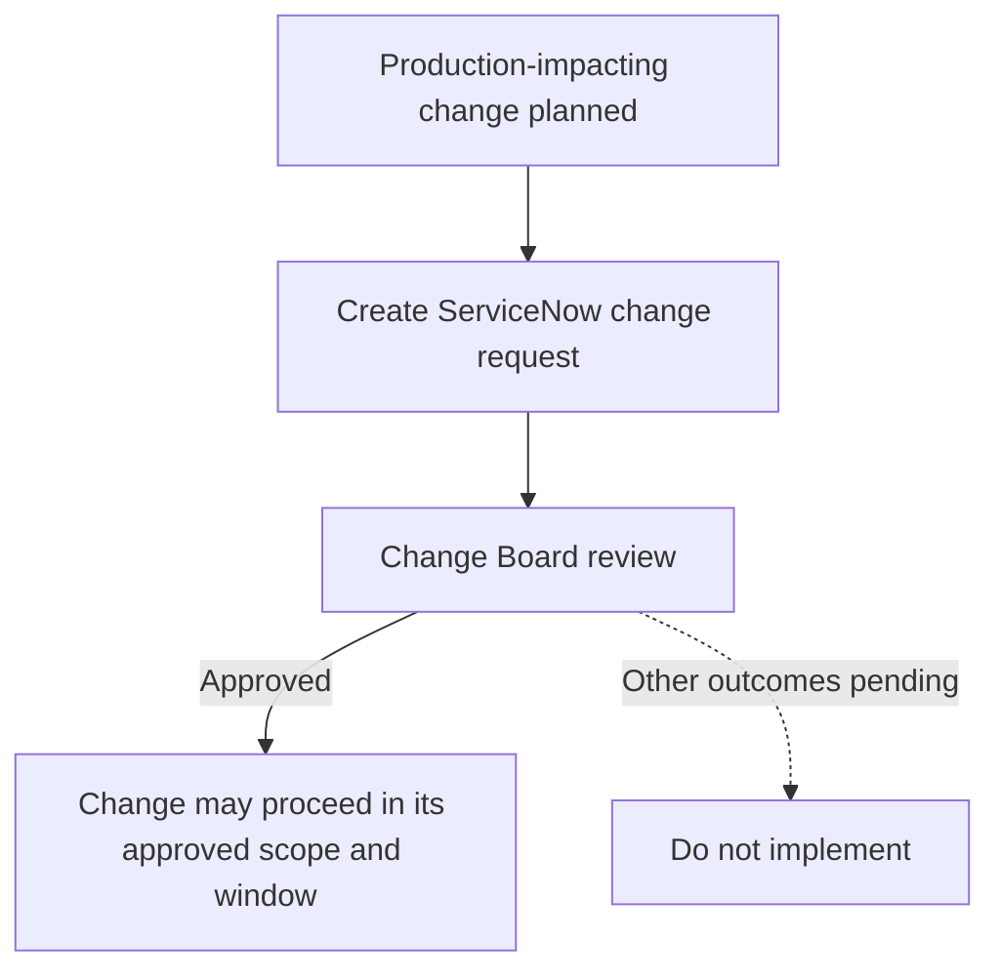

# Production Change Management

**Status:** User-confirmed mandatory approval requirement. Request mechanics, scope criteria, and operating procedures have not been verified.

**Source:** Production change requirement supplied by the user on 2026-09-03.

**Process owner:** Not yet supplied.

## Mandatory Requirement

Every production-impacting change **MUST** have a **ServiceNow change request** approved by the **Change Board** before implementation.

| Gate | Requirement |
| --- | --- |
| Change record | A ServiceNow change request **MUST** exist for the production-impacting change. |
| Approval | The Change Board **MUST** approve the request. |
| Implementation | The change **MUST NOT** be implemented before approval. |

Creating or submitting a change request is not approval. If approval cannot be verified, stop before implementation.

## Confirmed Workflow

The diagram shows the confirmed approval gate. Rejection, revision, emergency, standard-change, scheduling, notification, and escalation paths remain to be documented.

## Minimum Change Readiness Information

The required ServiceNow fields and evidence have not been supplied. As a practical baseline, prepare the following for review without treating this list as an approved template:

- business and technical reason for the change
- affected production services, APIs, resources, customers, and dependencies
- implementation plan with responsible implementer
- expected impact, risk, and planned window
- validation and monitoring plan
- tested rollback or recovery plan and stop conditions
- links to reviewed source, Terraform plan, test evidence, and related approvals
- security, public-access, network, data, and environment-isolation impacts

## Relationship to Engineering Controls

Change Board approval does not replace source review, required workflow approvals, security approval, a public-access exemption, or technical validation. The exact relationship between ServiceNow, GitHub, GitHub Actions, Azure DevOps, and deployment permissions remains to be documented.

Use the [Prepare a Production Change Runbook](../runbooks/prepare-production-change.md) as a draft readiness checklist. It does not replace the approved ServiceNow process.

## Process Details to Document

| Area | Details still needed |
| --- | --- |
| Scope | Definition and examples of production-impacting changes, including how PRD and shared-service changes are classified |
| Request process | ServiceNow catalog item, required fields, attachments, lead time, and submission instructions |
| Change Board | Membership, meeting schedule, quorum, approval evidence, and decision outcomes |
| Change types | Normal, standard, emergency, expedited, failed, and retrospective paths |
| Execution | Scheduling, communications, implementation authority, monitoring, stop conditions, and completion evidence |
| Closure | Validation, customer confirmation, incident linkage, rollback recording, review, and record closure |
| Escalation | Contacts, incident path, failed-change path, and emergency authority |

No ServiceNow request, approval, production deployment, or Azure change is created by this page.

## Related Documentation

- [Governance](README.md)
- [Environment Isolation](../architecture/environment-isolation.md)
- [Terraform Platform](../infrastructure-as-code/terraform-platform.md)
- [CI/CD](../ci-cd/README.md)
- [Runbooks](../runbooks/README.md)

[Home](../Home.md)
