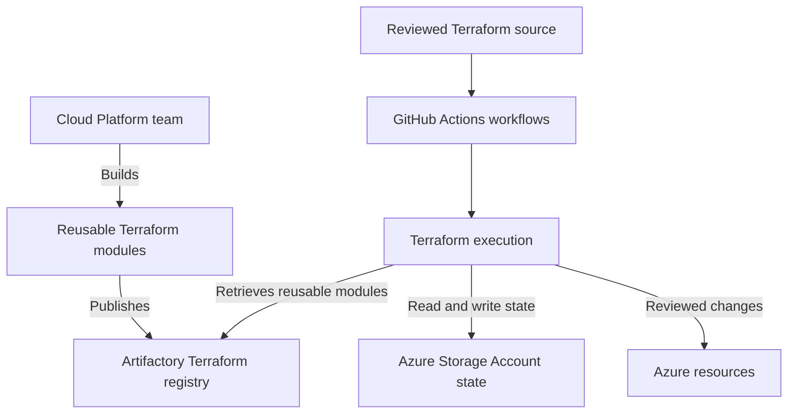

# Terraform Platform

**Status:** User-confirmed implementation and reusable-module publishing baseline. Detailed configuration and operational validation are pending.

**Source:** Platform implementation details supplied by the user on 2026-08-31 and 2026-09-03.

## Confirmed Toolchain

| Capability | Confirmed implementation |
| --- | --- |
| Terraform registry | Artifactory |
| Reusable Terraform modules | Built by the Cloud Platform team and published to Artifactory |
| Terraform state storage | Azure Storage Accounts |
| Workflow platform | GitHub Actions |

These facts identify the technologies in use. They do not establish endpoints, repository or account names, authentication methods, workflow inventories, or operating procedures.

## Confirmed Toolchain Relationship

The diagram shows how the confirmed technologies fit into the Terraform workflow and records the Cloud Platform team's reusable-module publishing responsibility. It does not define repository names, workflow triggers, runner placement, authentication, module catalog, release process, state layout, approval gates, or deployment permissions; those implementation details remain to be documented.

## Artifactory Terraform Registry

We use Artifactory as our Terraform registry. The **Cloud Platform team builds reusable Terraform modules and publishes them to the Artifactory Terraform registry**.

The registry endpoint, repository structure, module catalog, source repositories, testing standard, versioning, authentication, publication workflow, deprecation process, support model, and availability design remain to be documented. The confirmed module publishing responsibility does not by itself assign ownership of Artifactory administration, consuming repositories, or resources deployed from a module.

## Terraform State Storage

Terraform state files are stored in Azure Storage Accounts.

The subscriptions, resource groups, storage accounts, containers, state-key conventions, access controls, recovery settings, and operating procedures remain to be documented. State files, state contents, credentials, keys, and secrets must not be placed in this Wiki.

The storage resources are subject to the [Resource Security Baseline](../security/resource-security-baseline.md): public access must be disabled by default, Private Endpoints should be used where supported and applicable, TLS 1.2 or later is required, Storage Account soft delete must be enabled, and Storage Account container public access must be disabled. This records the requirements; it does not verify that any Storage Account complies or define the applicable endpoint, soft-delete, retention, or anonymous-access settings.

## GitHub Actions Workflows

We use GitHub Actions for our workflows.

The repository and workflow inventory, runner type, workload identity, permissions, approvals, secrets handling, deployment environments, validation, and rollback procedures remain to be documented.

The [DevOps Engineering Team](../ci-cd/README.md#environment-responsibilities) is responsible for the GitHub environment. That responsibility does not by itself identify owners of individual repositories, workflows, application code, or deployed Azure resources.

DEV, INT, CRT, and PRD are not cross-connected. Terraform state, variables, resource references, and module inputs must preserve those [environment boundaries](../architecture/environment-isolation.md).

A production-impacting Terraform change **MUST NOT** be applied until its ServiceNow change request is approved by the Change Board. See [Production Change Management](../governance/production-change-management.md).

## Implementation Details to Confirm

| Area | Details still needed |
| --- | --- |
| Reusable modules | Module catalog, source repositories, maintainers, testing, documentation, versioning, publication, deprecation, support, and consumer notification |
| Artifactory configuration | Endpoint, repository names, administrative ownership, access model, publication workflow, and availability design |
| State backend configuration | Storage inventory, container and state-key conventions, access model, recovery controls, and environment separation |
| Workflow configuration | Repository and workflow inventory, triggers, reusable workflows, runners, deployment environments, validation, and rollback |
| Access and identity | Authentication methods, workload identities, permissions, credential handling, and access-review procedures |
| Security and compliance | Enforcement and evidence for the resource security baseline, workflow protections, and approved exceptions, if any |
| Ownership and operations | Component owners, support contacts, request paths, approval responsibilities, monitoring, and incident procedures |

The entries above identify information to collect. They do not describe configuration or procedures already in place, and this page does not change infrastructure or workflow settings.

## Related Documentation

- [Terraform Command Cheat Sheet](../command-cheat-sheets/terraform.md)
- [Validate a Terraform Change Runbook](../runbooks/validate-terraform-change.md)
- [Troubleshoot Terraform Workflows](../troubleshooting/terraform.md)
- [Environment Isolation](../architecture/environment-isolation.md)
- [Production Change Management](../governance/production-change-management.md)
- [Infrastructure as Code](README.md)
- [CI/CD](../ci-cd/README.md)
- [Resource Security Baseline](../security/resource-security-baseline.md)
- [Standards and Guidelines](../standards-and-guidelines/README.md)
- [Terraform FAQ](../faq/README.md#terraform)

[Home](../Home.md)
