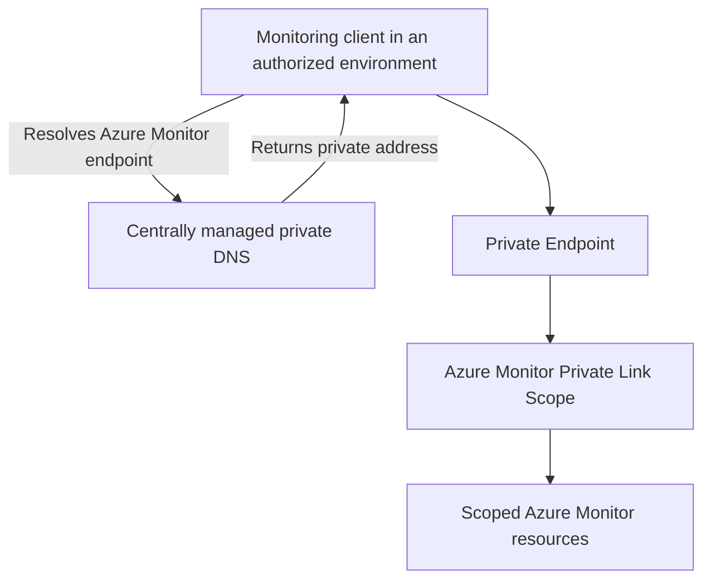

# Azure Monitor Private Link Scope

**Status:** User-confirmed platform technology. Scope inventory, topology, access modes, ownership, and operations have not been verified.

**Source:** Azure Monitor Private Link Scope usage supplied by the user on 2026-09-03.

**Owner:** Not yet supplied.

## Customer Outcome

We use **Azure Monitor Private Link Scope (AMPLS)** for private connectivity to Azure Monitor resources.

AMPLS associates supported Azure Monitor resources with Private Link access through a Private Endpoint. This statement confirms the technology in use; it does not establish which environments, networks, Log Analytics workspaces, Application Insights resources, data collection endpoints, or other monitoring resources are connected.

## Conceptual Relationship



The diagram shows the Azure Monitor Private Link concept used by the platform, not a deployed inventory or a confirmed end-to-end telemetry flow. Environment-to-AMPLS mappings, DNS zones, endpoint locations, ingestion paths, query paths, and resource membership remain to be documented.

## Security and Environment Requirements

- Public access is disabled by default for resources, and Private Endpoints should be used where supported and applicable.
- TLS 1.2 or later is required for applicable connections.
- Private DNS zones are centrally managed by the Cloud Platform Solutions and Services team.
- DEV, INT, CRT, and PRD are not cross-connected. AMPLS design and DNS resolution must preserve those environment boundaries.
- Ingestion and query access modes must match the intended architecture. The architecture and modes currently configured in deployed AMPLS resources have not been supplied.

Azure Monitor access modes and DNS behavior can affect every client that shares the connected network and DNS configuration. Do not change AMPLS membership, access modes, Private Endpoints, or related DNS as an ad hoc troubleshooting action.

## Troubleshooting Entry Points

For missing telemetry, failed Azure Monitor queries, or portal connectivity errors:

1. Confirm the affected environment, source, Azure Monitor resource, and whether the failure affects ingestion, queries, or both.
2. Resolve the relevant endpoint from the affected source and verify that it returns the expected private address.
3. Verify Private Endpoint provisioning and approval state.
4. Confirm that the target monitoring resource belongs to the expected AMPLS.
5. Confirm the applicable ingestion and query access modes.
6. Compare against recent changes without connecting to another environment as a workaround.

Use the [Private Connectivity Troubleshooting Guide](../troubleshooting/private-connectivity.md) for detailed low-risk diagnostics.

## Read-Only Inspection

With the intended subscription selected and appropriate read access:

```bash
az monitor private-link-scope show \
  --resource-group '<ampls-resource-group>' \
  --name '<ampls-name>' \
  --output jsonc

az monitor private-link-scope scoped-resource list \
  --resource-group '<ampls-resource-group>' \
  --scope-name '<ampls-name>' \
  --output table
```

The Azure CLI `monitor private-link-scope` command group is currently marked preview. Check the installed CLI help and current Microsoft reference before operational use. Treat resource names, IDs, access modes, and scope membership as sensitive internal configuration.

## Implementation Details to Document

| Area | Details still needed |
| --- | --- |
| Inventory | AMPLS resources, subscriptions, resource groups, regions, environments, and owners |
| Scoped resources | Log Analytics workspaces, Application Insights resources, data collection endpoints, and other linked resources |
| Network topology | Private Endpoints, VNets, subnets, environment mapping, routing, and Palo Alto inspection behavior |
| DNS | Required private DNS zones, links, records, resolution paths, and central-management workflow |
| Access modes | Ingestion and query access modes, per-network overrides, decision rationale, and validation |
| Operations | Monitoring, alerting, troubleshooting, recovery, support, and change procedures |
| Evidence | Current configuration, public-access state, connectivity tests, and periodic compliance validation |

No Azure Monitor, AMPLS, Private Endpoint, DNS, or network configuration is changed by this page.

## Related Documentation

- [Monitoring and Observability](README.md)
- [Private Endpoints](../networking/private-endpoints.md)
- [Private DNS Zone Management](../networking/private-dns-zone-management.md)
- [Environment Isolation](../architecture/environment-isolation.md)
- [Microsoft: Use Azure Private Link to connect networks to Azure Monitor](https://learn.microsoft.com/azure/azure-monitor/fundamentals/private-link-security)
- [Microsoft: Design Azure Monitor Private Link configuration](https://learn.microsoft.com/azure/azure-monitor/logs/private-link-design)

[Home](../Home.md)
