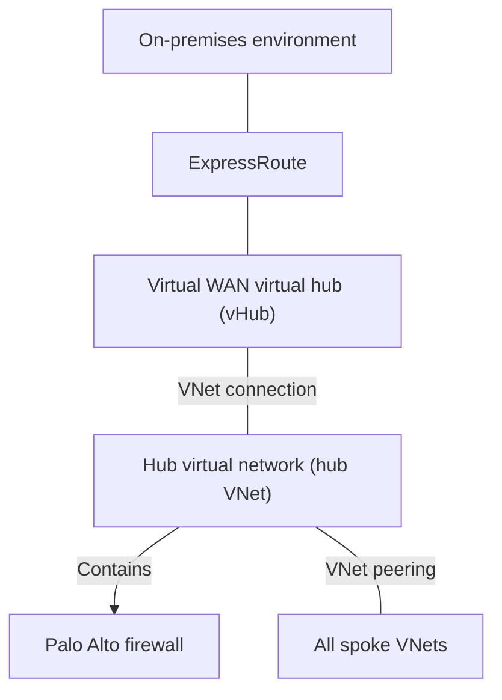

# ExpressRoute Connectivity

**Status:** User-confirmed connectivity. Detailed configuration and operational validation are pending.

**Source:** Platform descriptions and clarifications supplied by the user on 2026-08-31 and 2026-09-03.

**Owner:** Not yet supplied.

## Confirmed Use

We use Azure ExpressRoute for access to our on-premises environment. ExpressRoute connects to a virtual hub (vHub) in our Azure Virtual WAN. The vHub has a VNet connection to the hub virtual network (hub VNet).

This confirms ExpressRoute is in use. It does not establish that it is the only connectivity path, which sites or destinations are reachable, or which application flows are permitted.

## Service Context

ExpressRoute provides private connectivity between on-premises networks and Microsoft's cloud. See [Microsoft's ExpressRoute overview](https://learn.microsoft.com/en-us/azure/expressroute/expressroute-introduction).

The service overview is reference context, not a description of our specific circuits, provider, gateway deployment, or availability design.

## Relationship to the Platform

The [Hub-and-Spoke Network](../architecture/hub-and-spoke-network.md) documents the connected architecture:

- ExpressRoute connects to the vHub in our Virtual WAN.
- The vHub has a VNet connection to the hub VNet.
- The hub VNet contains the Palo Alto firewall.
- The hub VNet is VNet peered to all spokes.
- All workload VNet traffic is routed through and inspected by the Palo Alto firewall.

For the firewall and rule-management responsibility, see [Firewall Management](../architecture/hub-and-spoke-network.md#firewall-management). The ExpressRoute service owner remains unconfirmed.

These statements establish the component relationships, not the complete packet path. Exact circuit, gateway, peering, BGP, route-table, route-propagation, and forward and return-path details still need to be documented.

See the [Zero Trust Policy](../security/zero-trust-policy.md) and [Resource Security Baseline](../security/resource-security-baseline.md) for the recorded security policy and requirements. Connectivity alone is not an access approval or evidence that security requirements are met.

## Logical Connectivity View

The diagram shows confirmed logical connectivity and distinguishes the Virtual WAN vHub from the hub VNet. It is not a packet-flow diagram and does not assert undocumented gateway resources, routes, permitted destinations, or forward and return paths. See [Workload VNet Traffic Routing and Inspection](../architecture/hub-and-spoke-network.md#workload-vnet-traffic-routing-and-inspection) for the separately confirmed firewall requirement.

## Implementation Details to Confirm

| Area | Information needed |
| --- | --- |
| Circuit inventory | Circuit count, resource locations, provider or connectivity model, peering locations, bandwidth, and SKU |
| Virtual WAN attachment | Virtual WAN and vHub resource inventory, ExpressRoute gateway resources and configuration, and connection status |
| VNet connectivity | vHub-to-hub-VNet connection and hub-VNet-to-spoke peering inventory, configuration, status, and resiliency |
| Routing and access | ExpressRoute peering configuration, advertised and accepted prefixes, BGP settings, route tables and propagation, allowed flows, and forward and return paths through Palo Alto |
| Transport protection | Encryption configuration and evidence of the protection provided for applicable traffic |
| Name resolution | DNS resolution paths and forwarding configuration; [private DNS zones are centrally managed](private-dns-zone-management.md) |
| Availability and recovery | Redundancy, any backup connectivity, failover behavior, and recovery validation |
| Operations | Named owners, monitoring, change requests, troubleshooting, and escalation procedures |

These details must come from platform records or owner confirmation. This page does not provide deployment commands or an executable runbook, and no Azure or on-premises configuration has been changed.

## Related Documentation

- [Networking](README.md)
- [Using Azure](../using-azure/README.md)
- [Networking FAQ](../faq/README.md#networking)
- [Troubleshooting](../troubleshooting/README.md)

[Home](../Home.md)
