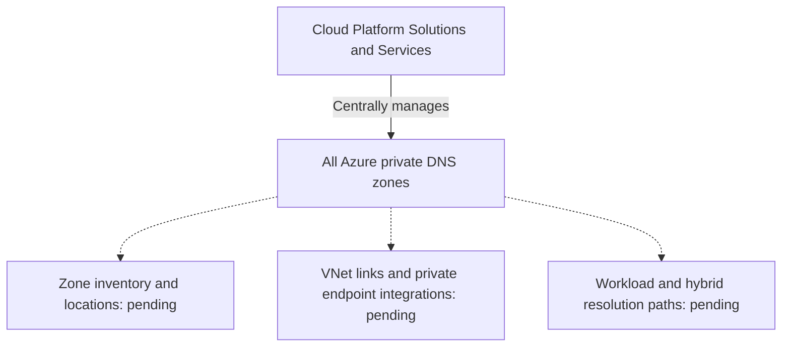

# Private DNS Zone Management

**Status:** User-confirmed management model and owning team. Detailed implementation and operational validation are pending.

**Source:** Platform description and ownership supplied by the user on 2026-08-31.

**Owner:** **Cloud Platform Solutions and Services** team.

## Confirmed Management Model

The **Cloud Platform Solutions and Services** team centrally manages all private DNS zones in our Azure platform.

This confirmed responsibility covers central management of the private DNS zones. It does not establish their subscription or resource group locations, virtual network links, the DNS resolution paths used by clients, or ownership of workload-specific DNS configuration. The management model for public DNS zones has not been supplied.

## Management Boundary

The solid arrow is the confirmed ownership relationship. Dashed arrows identify implementation areas that have not been supplied or validated. The diagram does not represent a DNS query path or imply that a consuming team can directly modify a centrally managed zone.

## Guidance for Consuming Teams

Use centrally managed private DNS zones as the documented management model when describing workload DNS integration. The Cloud Platform Solutions and Services team is the confirmed managing team. Contacts, processes for requesting zones, records, or network links, and any permissions delegated to consuming teams remain to be documented.

## Details to Confirm

| Area | Information needed |
| --- | --- |
| Ownership boundaries | Team contacts, service boundaries, decision and approval responsibilities, and escalation procedures |
| Zone inventory | Zone names, subscriptions, resource groups, and supported uses |
| Access and changes | Access controls, any delegated permissions, and request and approval procedures |
| Records and integrations | Record lifecycle, registration settings, and any private endpoint DNS integration or automation in use |
| Name resolution | Virtual network links, DNS server settings, forwarding, any resolvers in use, and workload or hybrid resolution paths where applicable |
| Operations | Deployment tooling, validation evidence, monitoring, troubleshooting, and recovery procedures |

These are information gaps, not descriptions of deployed components or established procedures. Central zone management alone does not verify name resolution for a workload.

No Azure DNS configuration has been changed by recording this management model.

## Related Documentation

- [Networking](README.md)
- [Hub-and-Spoke Network](../architecture/hub-and-spoke-network.md)
- [Platform Services](../platform-services/README.md)
- [Using Azure](../using-azure/README.md)
- [DNS FAQ](../faq/README.md#dns)

[Home](../Home.md)
