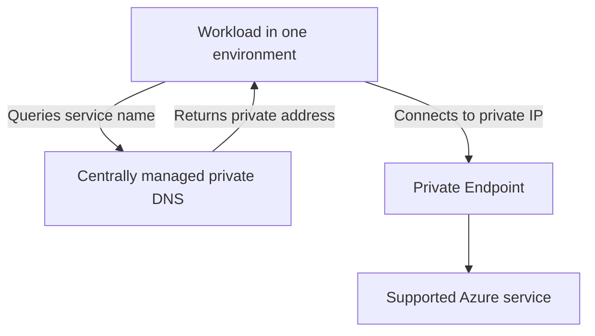

# Private Endpoints

**Status:** User-confirmed public-access requirement and private-access recommendation. Service coverage, ownership, request procedures, and compliance have not been verified.

**Source:** Private-access requirements supplied by the user on 2026-08-31 and 2026-09-03.

**Owner:** Not yet supplied.

## Customer Outcome

Public access is disabled by default for Azure resources. **Private Endpoints SHOULD be used when the target Azure service supports Private Link and private service access is applicable.**

A Private Endpoint gives a supported Azure service a private IP address in a virtual network. Its use does not by itself prove that DNS, routing, firewall inspection, identity, or the service's public-access setting is correct.

## Security Posture

| Control | Strength | Statement |
| --- | --- | --- |
| Public access | Mandatory | **MUST** be disabled by default for every Azure resource. |
| Private service access | Recommended | Private Endpoints **SHOULD** be used where supported and applicable. |
| Public-access exception | Mandatory | A resource that requires public access **MUST** follow the [Public Access Exemption Process](../security/public-access-exemption-process.md). |
| TLS | Mandatory | TLS 1.2 or later is **REQUIRED** for applicable TLS endpoints and connections. |
| Private DNS | Confirmed management model | All private DNS zones are centrally managed by the Cloud Platform Solutions and Services team. |
| Environment boundary | Mandatory | A Private Endpoint design **MUST NOT** create a direct cross-connection between DEV, INT, CRT, and PRD. |

## Conceptual Access Flow

The diagram shows the intended private-access relationship. It does not identify a deployed endpoint, DNS zone, VNet, subnet, route, firewall path, service subresource, or environment. Workload VNet traffic remains subject to the documented [Palo Alto inspection requirement](../architecture/hub-and-spoke-network.md#workload-traffic-requirement); the exact Private Endpoint traffic path still requires implementation evidence.

## Consumption Guidance

1. Confirm the target environment and service dependency.
2. Confirm that the service and required subresource support Private Link.
3. Keep the endpoint and its consumers within the documented environment boundary.
4. Coordinate Private Endpoint and centrally managed Private DNS configuration with the responsible teams. Those request paths have not yet been supplied.
5. Validate name resolution, endpoint approval state, TCP and TLS connectivity, and application behavior from an authorized source inside the target environment.
6. Keep the service's public access disabled unless a resource-specific Azure Policy exemption has completed the approved workflow.

Use the [Private Connectivity Troubleshooting Guide](../troubleshooting/private-connectivity.md) and [Validate a Private Endpoint Runbook](../runbooks/validate-private-endpoint.md) for read-only checks.

## Implementation Details to Document

| Area | Details still needed |
| --- | --- |
| Service coverage | Supported and required Azure services and subresources, known limitations, and approved alternatives |
| Endpoint placement | Subscription, resource group, VNet, subnet, environment, IP allocation, and naming standards |
| DNS | Zone selection, record ownership, zone links, resolution paths, registration workflow, and validation |
| Routing and inspection | Forward and return paths, Palo Alto inspection behavior, route controls, and network security controls |
| Identity and authorization | Deployment identity, endpoint approval authority, consumer permissions, and access reviews |
| Operations | Monitoring, health checks, incident response, recovery, deletion sequencing, and support contacts |
| Compliance | Azure Policy assignments, infrastructure-as-code defaults, inventory, exception status, and evidence |

No Private Endpoint, DNS record, route, firewall rule, policy exemption, or Azure resource is created or changed by this documentation.

## Related Documentation

- [Networking](README.md)
- [Private DNS Zone Management](private-dns-zone-management.md)
- [Environment Isolation](../architecture/environment-isolation.md)
- [Resource Security Baseline](../security/resource-security-baseline.md)
- [Public Access Exemption Process](../security/public-access-exemption-process.md)
- [Microsoft: What is a private endpoint?](https://learn.microsoft.com/azure/private-link/private-endpoint-overview)

[Home](../Home.md)
