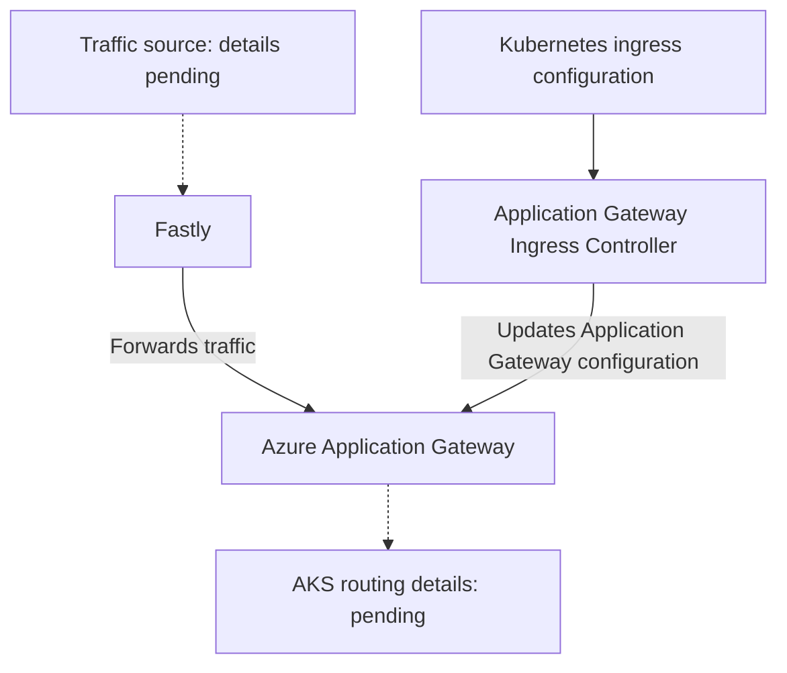

# Azure Kubernetes Service (AKS)

**Status:** User-confirmed ingress technologies, local-account requirement, and Azure RBAC requirement. Cluster architecture, configuration, ownership, and operations remain to be documented.

**Source:** AKS requirements and application-ingress descriptions supplied by the user on 2026-08-31, 2026-09-01, and 2026-09-03.

**Service owner:** Not yet supplied.

## Confirmed Ingress Implementation

We use **Application Gateway Ingress Controller (AGIC)** for ingress to our AKS clusters.

| Capability | Confirmed implementation |
| --- | --- |
| Container platform | Azure Kubernetes Service (AKS) clusters |
| Ingress controller | Application Gateway Ingress Controller (AGIC) |

This confirms the ingress controller technology in use. It does not establish the AKS or Application Gateway inventory, controller deployment mode, topology, configuration, or operating model. It also does not establish whether every cluster is configured identically or whether other ingress controllers or ingress paths are in use.

The broader [Application Ingress](application-ingress.md) architecture confirms that Fastly fronts our application environments and forwards traffic to Azure Application Gateway. The mapping between that general ingress path and individual AKS clusters remains to be documented.

## Logical Ingress Relationship

The solid arrows show the confirmed Fastly-to-Application-Gateway flow and the standard controller relationship used by the confirmed AGIC technology. Dashed arrows mark traffic-path details that remain unverified, including the traffic source, whether the Application Gateway frontend is private or public, how TLS terminates, and how requests reach AKS workloads. The combined view does not establish that every Fastly route targets AKS, and it does not represent a deployed cluster inventory.

## Mandatory Local-Account Requirement

Local accounts **MUST** be disabled on every AKS cluster.

This is a mandatory configuration requirement, not a claim that existing clusters currently comply. Authentication configuration, implementation method, administrative access path, break-glass access, enforcement, exception process, and validation evidence remain to be documented.

## Mandatory Azure RBAC Requirement

Azure role-based access control (Azure RBAC) for Kubernetes Authorization **MUST** be enabled on every AKS cluster.

This is a mandatory authorization requirement, not a claim that existing clusters currently comply. Microsoft Entra integration, Azure role definitions and assignments, assignment scopes, privileged-access workflow, any remaining Kubernetes RBAC usage, enforcement, exception handling, and validation evidence remain to be documented.

## Security and Network Requirements

AKS and Application Gateway resources are subject to the [Resource Security Baseline](../security/resource-security-baseline.md): public access must be disabled by default, and TLS 1.2 or later is required for applicable TLS endpoints.

This page does not confirm whether any Application Gateway frontend is public. A resource that requires public access must follow the [Public Access Exemption Process](../security/public-access-exemption-process.md). That process applies only to public access and does not authorize AKS local accounts to be enabled or Azure RBAC for Kubernetes Authorization to be disabled.

Fastly configuration, TLS termination points, certificate sources, frontend and backend protocols, WAF configuration, network flows, DNS dependencies, and the interaction with the [Hub-and-Spoke Network](../architecture/hub-and-spoke-network.md) remain to be documented.

## Implementation Details to Document

| Area | Details still needed |
| --- | --- |
| AKS architecture | Cluster inventory, subscriptions, regions, versions, node pools, availability, API access, and network model |
| Fastly integration | Service and environment mapping, origin configuration, domains, routing, security features, health checks, and ownership |
| AGIC deployment | Add-on or Helm deployment, versions, release process, watched namespaces, ingress classes, and update strategy |
| Application Gateway topology | Gateway inventory, shared or dedicated model, SKU, WAF mode, frontend addresses, listeners, backend pools, and probes |
| Ingress configuration | Host and path routing, annotations, backend protocols, health checks, redirects, and supported application patterns |
| Identity and access | Configured local-account and Azure RBAC states, Microsoft Entra integration, Azure role definitions, assignments and scopes, any remaining Kubernetes RBAC usage, controller identity, administrative access, credential handling, and break-glass access |
| TLS and certificates | Termination points, certificate source and renewal, supported protocols and cipher configuration, and validation evidence |
| Networking and DNS | Subnets, routes, security controls, private or public exposure, name resolution, and firewall dependencies |
| Security validation | Evidence that local accounts are disabled and Azure RBAC for Kubernetes Authorization is enabled on every cluster, and that the applicable public-access and TLS requirements are met |
| Operations | Monitoring, logging, alerting, upgrades, troubleshooting, backup, recovery, and failure handling |
| Ownership | Owners and support contacts for AKS, Application Gateway, AGIC, application ingress configuration, and incident escalation |

The entries above identify information to collect. They do not describe configuration or procedures already in place, and this page does not change any AKS, Application Gateway, identity, authorization, access, or ingress configuration.

## Related Documentation

- [Application Ingress](application-ingress.md)
- [Microsoft: Application Gateway Ingress Controller overview](https://learn.microsoft.com/en-us/azure/application-gateway/ingress-controller-overview)
- [Platform Services](README.md)
- [Azure Services](../azure-services/README.md)
- [Networking](../networking/README.md)
- [Resource Security Baseline](../security/resource-security-baseline.md)
- [Public Access Exemption Process](../security/public-access-exemption-process.md)
- [Using Azure](../using-azure/README.md)
- [AKS FAQ](../faq/README.md#aks)

[Home](../Home.md)
