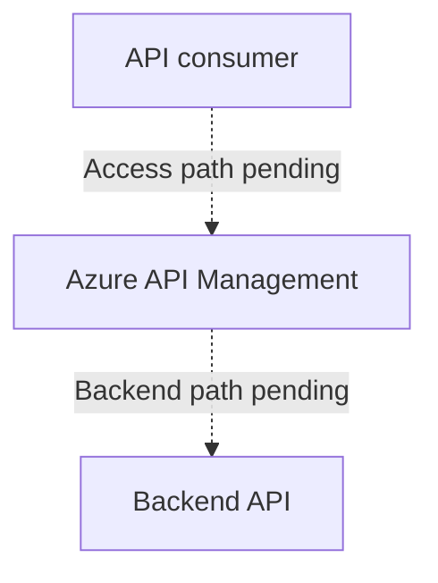

# Azure API Management

**Status:** User-confirmed platform service. Service inventory, supported consumption model, architecture, ownership, and operations have not been verified.

**Source:** Azure API Management usage supplied by the user on 2026-09-03.

**Service owner:** Not yet supplied.

## Customer Outcome

We use **Azure API Management (APIM)** for APIs.

APIM provides the logical API gateway and management layer between API consumers and backend APIs. The specific APIs, gateway hostnames, products, subscriptions, policies, tiers, environments, and onboarding process available to customers remain to be documented.

## Conceptual Service Relationship

The diagram identifies APIM's confirmed role for APIs while marking both network paths as unverified. It does not establish whether Fastly or Application Gateway is in an API path, whether the APIM gateway is private or public, or where any backend is hosted.

## Platform Requirements

| Control | Strength | Statement |
| --- | --- | --- |
| Public access | Mandatory | **MUST** be disabled by default. |
| Private Endpoints | Recommended | **SHOULD** be used where supported and applicable. |
| TLS | Mandatory | TLS 1.2 or later is **REQUIRED** for applicable connections. |
| Private DNS | Confirmed management model | Private DNS zones are centrally managed by the Cloud Platform Solutions and Services team. |
| Environment isolation | Mandatory | API designs and dependencies **MUST NOT** create cross-connections between DEV, INT, CRT, and PRD. |
| Public endpoint | Mandatory exception process | Requires the [Public Access Exemption Process](../security/public-access-exemption-process.md). |
| Production change | Mandatory approval | Requires a [ServiceNow change request](../governance/production-change-management.md) approved by the Change Board before implementation. |

These are platform requirements, not evidence that an existing APIM instance complies.

## Before Requesting or Publishing an API

The confirmed request channel and onboarding procedure have not been supplied. Before implementation, the service documentation must identify:

- target environment and API owner
- consumer and backend network paths
- authentication and authorization model
- API contract and versioning approach
- required APIM policies and secrets handling
- DNS, certificates, TLS termination, and Private Endpoint requirements
- monitoring, logging, support, and production-change requirements

Do not place API keys, subscription keys, tokens, certificates, backend credentials, or sensitive payloads in the Wiki, tickets, command history, or troubleshooting evidence.

## Troubleshooting

Use [Troubleshoot Azure API Management](../troubleshooting/api-management.md) to separate client-to-gateway failures from gateway-to-backend failures and to collect a safe escalation package.

## Implementation Details to Document

| Area | Details still needed |
| --- | --- |
| Service inventory | APIM instances, tiers, regions, environments, subscriptions, resource groups, and owners |
| Customer model | Supported API use cases, onboarding, request channel, approval, products, subscriptions, and lifecycle |
| Inbound path | Consumers, Fastly or Application Gateway dependencies, gateway endpoints, Private Endpoints, DNS, certificates, and TLS |
| Backend path | Backend inventory, routing, identity, authorization, DNS, Private Endpoints, timeouts, and resiliency |
| API configuration | APIs, operations, revisions, versions, products, policies, named values, and secret references |
| Security | Public-access state, network controls, authentication, authorization, certificate handling, threat protections, and validation |
| Operations | Deployment, monitoring, diagnostics, backup, recovery, scaling, maintenance, troubleshooting, and escalation |

No APIM instance, API, policy, Private Endpoint, DNS record, certificate, or backend is created or changed by this documentation.

## Related Documentation

- [Platform Services](README.md)
- [Private Endpoints](../networking/private-endpoints.md)
- [Environment Isolation](../architecture/environment-isolation.md)
- [Resource Security Baseline](../security/resource-security-baseline.md)
- [Microsoft: Azure API Management documentation](https://learn.microsoft.com/azure/api-management/)
- [Microsoft: Connect privately to API Management](https://learn.microsoft.com/azure/api-management/private-endpoint)

[Home](../Home.md)
