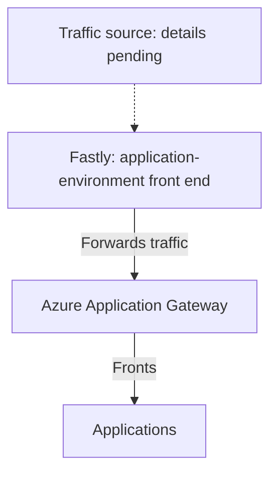

# Application Ingress with Fastly and Azure Application Gateway

**Audience:** Application teams, platform engineers, network engineers, security teams, and operations teams

**Status:** User-confirmed application ingress architecture. Detailed configuration, ownership, and operational validation are pending.

**Source:** Platform description supplied by the user on 2026-09-03.

**Service owners:** Not yet supplied.

## Confirmed Application Traffic Path

Fastly fronts our application environments. Fastly forwards traffic to Azure Application Gateway, which fronts the applications.

| Traffic layer | Confirmed role |
| --- | --- |
| Application-environment front end | Fastly |
| Azure application front end | Azure Application Gateway receives traffic forwarded by Fastly and fronts the applications |
| Application layer | Applications are reached through Application Gateway |

On this page, **fronts** means that a component receives traffic before forwarding it toward the next application layer. It does not by itself define public or private exposure, DNS, TLS termination, web application firewall (WAF) behavior, authentication, routing rules, or ownership.

## Logical Ingress Flow

The solid arrows show the confirmed application traffic sequence from Fastly to Application Gateway to the applications. The dashed arrow indicates that the traffic sources and how they reach Fastly have not been documented. The diagram is logical and does not represent a service inventory, a specific application, or a complete network packet path.

## Guidance for Application Teams

Use Fastly followed by Azure Application Gateway as the documented application-ingress pattern when describing application environments. This page does not establish that application teams can configure either layer directly, that every environment uses identical settings, or that a request and onboarding process has been approved.

The service owners, request channel, required onboarding information, division of responsibilities, and support and escalation procedures still need to be supplied before this page can provide an executable customer journey.

## Relationship to AKS

The [Azure Kubernetes Service (AKS)](aks.md) page separately confirms Application Gateway Ingress Controller (AGIC) as the ingress controller used for our AKS clusters. AGIC manages Application Gateway configuration from Kubernetes ingress resources.

The mapping between Fastly configurations, Application Gateways, application environments, and individual AKS clusters has not been documented. The confirmed general ingress path does not prove that every Fastly route targets AKS or that every application is hosted on AKS.

## Relationship to API Management

We use [Azure API Management](api-management.md) for APIs. The relationship between APIM, Fastly, Application Gateway, and backend APIs has not been supplied, so APIM is not added to the confirmed ingress sequence on this page.

## Security and Network Requirements

Azure resources in this path are subject to the [Resource Security Baseline](../security/resource-security-baseline.md): public access must be disabled by default, Private Endpoints should be used where supported and applicable, and TLS 1.2 or later is required for applicable TLS endpoints.

This page does not confirm whether Application Gateway uses a public or private frontend or how Fastly reaches it. If an Azure resource requires public access, the resource-specific request must follow the [Public Access Exemption Process](../security/public-access-exemption-process.md).

Workload VNet traffic remains subject to the documented [Palo Alto routing and inspection baseline](../architecture/hub-and-spoke-network.md). The exact interaction between the ingress path, the hub-and-spoke network, and the firewall has not been documented.

DEV, INT, CRT, and PRD are not cross-connected. Ingress and backend designs must preserve the documented [Environment Isolation](../architecture/environment-isolation.md).

## Implementation Details to Document

| Area | Details still needed |
| --- | --- |
| Fastly | Service inventory, environment mapping, domains, routing rules, origin configuration, health checks, header handling, and approved security features |
| Application Gateway | Gateway inventory, shared or dedicated model, SKU, WAF mode, frontend addresses, listeners, routing rules, backend pools, probes, and rewrite configuration |
| Application mapping | Applications and environments served by each Fastly service and Application Gateway |
| Connectivity and DNS | Traffic sources, public or private exposure, Fastly-to-Application-Gateway connectivity, DNS resolution, routes, firewall dependencies, and return paths |
| TLS and certificates | Termination points, certificate sources and renewal, frontend and backend protocols, minimum-version enforcement, and validation evidence |
| Security | Authentication boundaries, WAF policy placement, source restrictions, trusted headers, logging, and evidence that applicable security requirements are met |
| Availability and recovery | Regional design, redundancy, failover behavior, dependency failures, recovery procedures, and validation |
| Monitoring and operations | Health signals, logs, metrics, alerts, deployment and change processes, troubleshooting, and incident response |
| Ownership and support | Owners for Fastly, Application Gateway, application routing, DNS, certificates, security policy, customer requests, support, and escalation |

These entries identify information to collect. They do not describe configuration or procedures already in place, and this page does not change Fastly, Application Gateway, application, network, DNS, security, or routing configuration.

## Related Documentation

- [Azure Kubernetes Service (AKS)](aks.md)
- [Azure API Management](api-management.md)
- [Environment Isolation](../architecture/environment-isolation.md)
- [Private Endpoints](../networking/private-endpoints.md)
- [Hub-and-Spoke Network](../architecture/hub-and-spoke-network.md)
- [Networking](../networking/README.md)
- [Resource Security Baseline](../security/resource-security-baseline.md)
- [Public Access Exemption Process](../security/public-access-exemption-process.md)
- [Using Azure](../using-azure/README.md)
- [Application Ingress FAQ](../faq/README.md#application-ingress)

[Home](../Home.md)
