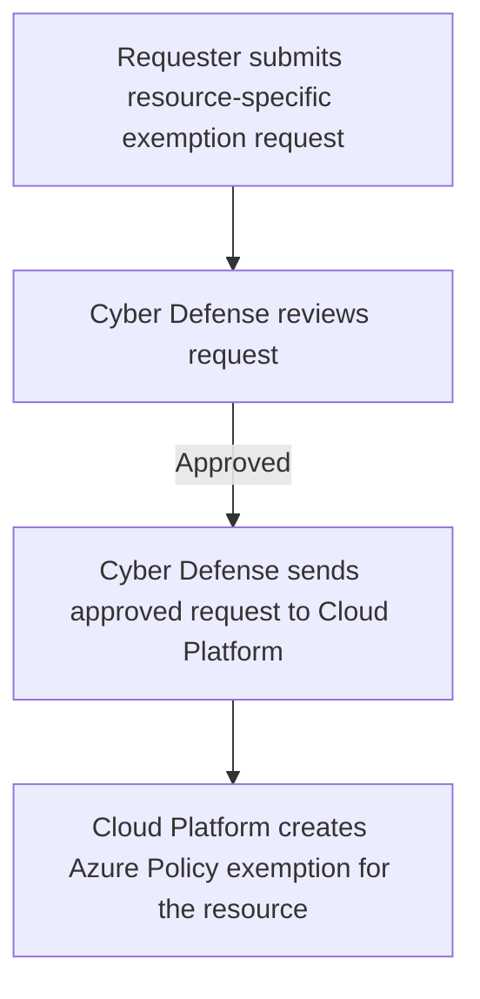

# Public Access Exemption Process

**Status:** User-confirmed approval and implementation workflow. Request mechanics and lifecycle details remain to be documented.

**Source:** Public-access exemption process supplied by the user on 2026-08-31.

**Process owner:** Not yet supplied.

## Purpose and Scope

Public access must be disabled by default for all resources. This process applies when a requester needs a specific Azure resource to have public access and therefore requires an exemption from that default.

This page records the confirmed review, approval, handoff, and implementation path. It does not establish a request channel, approval criteria, or exemption lifetime, and it does not verify any existing exemption.

## Required Workflow

1. The requester **MUST** submit a public-access exemption request for the resource that requires public access.
2. The **Cyber Defense team in Security** **MUST** review the request.
3. If Cyber Defense approves the request, Cyber Defense sends the approved request to the **Cloud Platform team**.
4. The Cloud Platform team creates the Azure Policy exemption for the specified resource.

The diagram shows the confirmed path for an approved request. Rejection, revision, resubmission, and escalation paths have not been supplied.

Submitting a request or receiving Cyber Defense approval does not itself create an Azure Policy exemption. The resource **MUST NOT** be treated as exempt from the public-access default until the Cloud Platform team has created the resource-specific exemption.

## Responsibilities

| Participant | Confirmed responsibility |
| --- | --- |
| Requester | Submit a public-access exemption request for the resource that requires public access. |
| Cyber Defense team in Security | Review the request and, if approved, send it to the Cloud Platform team. |
| Cloud Platform team | Create the Azure Policy exemption for the specified resource after receiving the approved request. |

These responsibilities are limited to the supplied workflow. They do not identify who configures public access on the resource, validates the resulting configuration, monitors the exemption, or renews or removes it.

## Process Details to Document

| Area | Details still needed |
| --- | --- |
| Request submission | Request system or channel, request template, required fields, and supporting evidence |
| Cyber Defense review | Approval criteria, authorized reviewers, decision record, review target, and notification process |
| Other decision paths | Rejection, revision, resubmission, emergency, and escalation procedures |
| Azure Policy implementation | Applicable policy assignments, exemption configuration, naming, metadata, and implementation validation |
| Resource configuration | Who enables public access, when the change may occur, and how the resource is validated after the exemption is created |
| Exemption lifecycle | Effective date, expiration, renewal, periodic review, revocation, and removal procedures |
| Audit and reporting | Evidence retention, exemption inventory, compliance reporting, monitoring, and notifications |

The entries above identify information to collect; they are not additional requirements or procedures already in place.

## Guardrails

- The confirmed process is resource-specific; it does not document a blanket exemption.
- The public-access default remains in effect unless the approved Azure Policy exemption has been created for the resource.
- This process is limited to public access. It does not document an exemption from the TLS 1.2 minimum or any other security requirement.
- Recording this process does not create an exemption or change Azure configuration.

## Related Documentation

- [Resource Security Baseline](resource-security-baseline.md)
- [Security](README.md)
- [Zero Trust Policy](zero-trust-policy.md)
- [Governance](../governance/README.md)
- [Using Azure](../using-azure/README.md)
- [Security FAQ](../faq/README.md#security)

[Home](../Home.md)
