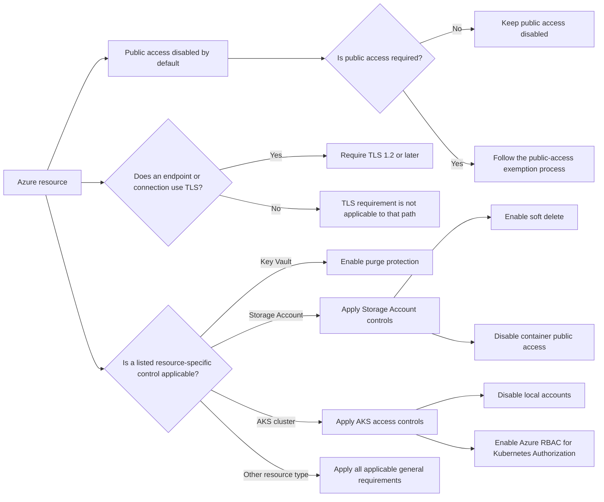

# Resource Security Baseline

**Status:** User-confirmed general and resource-specific security requirements, plus the public-access exemption workflow. Enforcement and compliance have not been verified.

**Source:** Platform requirements supplied by the user on 2026-08-31, 2026-09-01, and 2026-09-03.

**Owner:** Not yet supplied.

## Purpose and Scope

This standard records general security requirements for Azure resources, including the shared public-access default and minimum TLS version, plus resource-specific deletion-protection, Storage Account container-public-access, AKS local-account, and AKS Azure RBAC requirements. It defines required behavior, not a claim that existing resources already comply.

All resources are in scope for the public-access default. The TLS requirement applies to endpoints and connections that use TLS. The purge-protection requirement applies to Azure Key Vault resources; the soft-delete and container-public-access requirements apply to Azure Storage Accounts; and the local-account and Azure RBAC requirements apply to every AKS cluster.

## Mandatory Requirements

Requirements are grouped by applicability. General requirements apply across Azure resource types. Resource-specific requirements apply only to the named resource type and are additional to all applicable general requirements.

### General Requirements

| Control | Applicability | Requirement |
| --- | --- | --- |
| Public access | Every Azure resource | Public access **MUST** be disabled by default. |
| Minimum TLS version | Every endpoint and connection that uses TLS | TLS 1.2 or later is **REQUIRED**. TLS versions earlier than 1.2 **MUST NOT** be permitted. |

TLS 1.2 is the minimum, not a requirement to use exactly that version. Disabling public access does not remove the minimum TLS requirement.

### Resource-Specific Requirements

| Resource type | Control | Requirement |
| --- | --- | --- |
| Azure Key Vault | Purge protection | Purge protection **MUST** be enabled for every Azure Key Vault. |
| Azure Storage Account | Soft delete | Soft delete **MUST** be enabled for every Azure Storage Account. |
| Azure Storage Account | Container public access | Container public access **MUST** be disabled on every Azure Storage Account. |
| Azure Kubernetes Service (AKS) cluster | Local accounts | Local accounts **MUST** be disabled on every AKS cluster. |
| Azure Kubernetes Service (AKS) cluster | Azure RBAC for Kubernetes Authorization | Azure RBAC for Kubernetes Authorization **MUST** be enabled on every AKS cluster. |

Each named resource must also satisfy all applicable [General Requirements](#general-requirements).

## Requirement Applicability

The branches are cumulative, not alternatives. A Key Vault must satisfy its resource-specific control and every applicable general requirement. A Storage Account must satisfy both Storage Account controls and every applicable general requirement. An AKS cluster must satisfy both AKS access controls and every applicable general requirement. The diagram states required outcomes; it does not verify compliance or define service-specific implementation settings.

## Resource-Specific Control Details

### Deletion Protection

Azure Key Vault purge protection and Azure Storage Account soft delete are mandatory controls. They are requirements, not claims that existing resources currently comply.

The Storage Account requirement is confirmed at the account level. The applicable storage services and data types, required soft-delete settings, retention periods, recovery procedures, and permanent-deletion procedures remain to be documented.

### Storage Container Public Access

Container public access **MUST** be disabled on every Azure Storage Account. Blob containers **MUST NOT** permit anonymous public access. This is a required end state, not a claim that existing Storage Accounts currently comply.

Container public access and public network access are separate controls. Disabling container public access prevents anonymous access to blob data; it does not by itself establish network reachability or define access for authenticated identities. The exact account-level and container-level settings, inventory, enforcement, validation evidence, and current compliance remain to be documented.

A request to enable container public access is a request for public access and **MUST** follow the [Public Access Exemption Process](public-access-exemption-process.md). The approval criteria and whether such a request can be approved remain to be documented.

### AKS Local Accounts

Local accounts **MUST** be disabled on every AKS cluster. This is a required end state, not a claim that existing clusters currently comply.

Authentication configuration, implementation method, administrative access path, break-glass access, validation evidence, and any exception process remain to be documented.

### AKS Azure RBAC

Azure RBAC for Kubernetes Authorization **MUST** be enabled on every AKS cluster. This is a required end state, not a claim that existing clusters currently comply.

Microsoft Entra integration, Azure role definitions and assignments, assignment scopes, privileged-access workflow, any remaining Kubernetes RBAC usage, validation evidence, and any exception process remain to be documented.

The [Public Access Exemption Process](public-access-exemption-process.md) applies only to public access. It does not authorize an exception from Key Vault purge protection, Storage Account soft delete, the AKS local-account requirement, the AKS Azure RBAC requirement, the minimum TLS version, or any other control.

## Public Access Exemptions

A requester that requires a specific resource to have public access **MUST** follow the [Public Access Exemption Process](public-access-exemption-process.md):

1. Submit a public-access exemption request for the resource.
2. Obtain review and approval from the Cyber Defense team in Security.
3. Cyber Defense sends the approved request to the Cloud Platform team.
4. The Cloud Platform team creates the Azure Policy exemption for that resource.

The resource **MUST NOT** be treated as exempt from the public-access default until the Cloud Platform team has created the resource-specific Azure Policy exemption. The request channel, approval criteria, implementation details, validation, and exemption lifecycle remain to be documented.

## Implementation and Validation to Document

| Area | Details still needed |
| --- | --- |
| Public-access configuration | Resource inventory, the controls that disable public access for each resource type, and the configured defaults |
| TLS configuration | Applicable endpoints and TLS termination points, service-specific settings, and any configuration limitations |
| Key Vault purge protection | Key Vault inventory, configured purge-protection state, retention configuration, recovery and purge procedures, and validation evidence |
| Storage Account soft delete | Storage Account inventory, applicable services and data types, configured soft-delete settings, retention periods, recovery procedures, and validation evidence |
| Storage Account container public access | Storage Account and container inventory, configured anonymous-access settings, enforcement method, exemption status, and validation evidence |
| AKS local accounts | Cluster inventory, configured local-account state, implementation and validation method, supported administrative access path, break-glass process, and validation evidence |
| AKS Azure RBAC | Cluster inventory, configured Azure RBAC state, Microsoft Entra integration, Azure role definitions, assignments and scopes, privileged-access workflow, any remaining Kubernetes RBAC usage, implementation method, and validation evidence |
| Enforcement | How the requirements are enforced, including any Azure Policy assignments, infrastructure-as-code defaults, or deployment checks actually in use |
| Validation evidence | Evidence that public access is disabled by default, applicable TLS endpoints reject versions below 1.2, Key Vault purge protection is enabled, Storage Account soft delete is enabled, Storage Account container public access is disabled, local accounts are disabled on every AKS cluster, and Azure RBAC for Kubernetes Authorization is enabled on every AKS cluster |
| Existing resources | Current compliance findings, any remediation work, and responsible owners |
| Exceptions | Request channel, approval criteria, required evidence, implementation validation, expiration, renewal, revocation, and exception inventory |
| Deletion-protection exceptions | Any approved exception criteria or process for Key Vault purge protection or Storage Account soft delete; none has been supplied for this documentation |
| Storage container-public-access exceptions | Whether these requests can be approved, approval criteria, required evidence, implementation validation, expiration, renewal, revocation, and exception inventory; none has been supplied beyond the general public-access exemption workflow |
| AKS local-account exceptions | Any approved exception criteria or process for enabling AKS local accounts; none has been supplied for this documentation |
| AKS Azure RBAC exceptions | Any approved exception criteria or process for disabling Azure RBAC for Kubernetes Authorization; none has been supplied for this documentation |

The entries above identify information to collect, not controls or processes already deployed. Service limitations do not establish an exception, and this page does not authorize public access, a lower TLS minimum, disabled Key Vault purge protection, disabled Storage Account soft delete, Storage Account container public access to be enabled, AKS local accounts to be enabled, or Azure RBAC for Kubernetes Authorization to be disabled.

No Azure configuration has been changed by recording these requirements. Resource-specific implementation instructions and operational validation remain pending.

## Related Documentation

- [Security](README.md)
- [Zero Trust Policy](zero-trust-policy.md)
- [Public Access Exemption Process](public-access-exemption-process.md)
- [Standards and Guidelines](../standards-and-guidelines/README.md)
- [Governance](../governance/README.md)
- [Networking](../networking/README.md)
- [Azure Kubernetes Service (AKS)](../platform-services/aks.md)
- [Using Azure](../using-azure/README.md)
- [Security FAQ](../faq/README.md#security)
- [Key Vault and Storage FAQ](../faq/README.md#key-vault-and-storage)
- [AKS FAQ](../faq/README.md#aks)

[Home](../Home.md)
