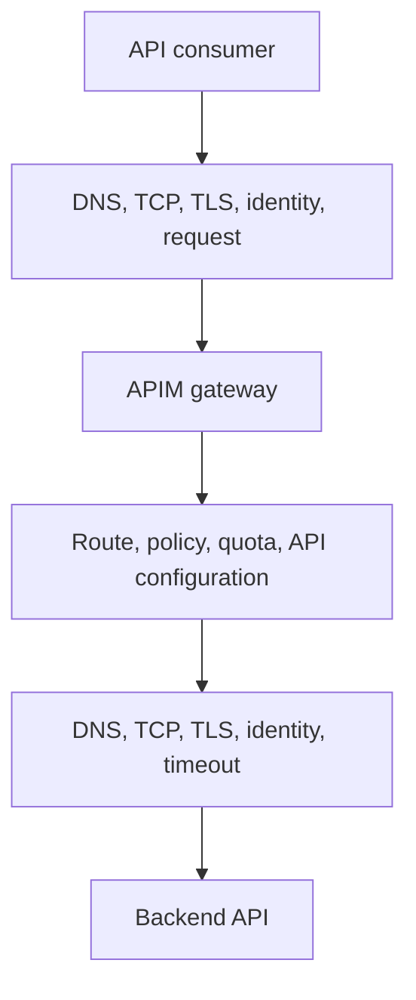

# Troubleshoot Azure API Management

**Status:** Draft diagnostic guidance. Commands are read-only or non-mutating, but the procedure has not been tested against an organization-specific APIM inventory.

**Audience:** API owners, application engineers, and platform engineers diagnosing APIM gateway or backend failures.

**Owner:** Not yet supplied.

## Problem

An API consumer cannot resolve, connect to, authenticate with, or receive the expected response from an API exposed through Azure API Management (APIM).

## Customer-Safe and Privileged Checks

| Access level | Checks |
| --- | --- |
| Customer-safe | Repeat a documented non-mutating API request with the caller's existing access; record sanitized status, timing, correlation identifier, and DNS result. |
| Privileged operator | Inspect APIM resource and API metadata, Private Endpoint state, diagnostics, policies, backend configuration, or Azure activity. Use the designated administrative account and MFA when elevated Azure access is required. |

Stop after customer-safe evidence collection if the caller is not authorized to inspect the APIM service or backend.

## First Classify the Failure



Identify the last successful layer before changing anything. A client-to-gateway failure and an APIM-to-backend failure require different evidence and owners.

## Symptom Guide

| Symptom | First checks |
| --- | --- |
| DNS failure or unexpected public address | Private DNS, expected gateway hostname, client environment, and Private Endpoint |
| TCP timeout | Private Endpoint state, same-environment route, network security controls, Palo Alto rule, and gateway health |
| TLS or certificate error | Hostname, certificate name, trust chain, validity, and TLS termination point |
| `401 Unauthorized` | Consumer credential, authentication policy, token audience or issuer, and time synchronization |
| `403 Forbidden` | Authorization policy, product or subscription access, IP/network policy, or use of a public path when public access is disabled |
| `404 Not Found` | Gateway hostname, API suffix, operation path, method, revision, version, and deployment state |
| `429 Too Many Requests` | APIM quota or rate-limit policy, backend throttle, and retry behavior |
| `500`, `502`, `503`, or `504` | Policy failure, backend health, backend DNS or connectivity, timeout, certificate, or capacity |
| One environment works and another fails | Environment-specific APIM, API, policy, DNS, endpoint, backend, or identity configuration |

## Step 1: Capture a Safe Request Result

Use a documented non-mutating API operation from an authorized client in the affected environment. Supply credentials through the organization's secret mechanism, not directly in command history.

```bash
nslookup '<apim-gateway-fqdn>'

curl --silent --show-error \
  --output /dev/null \
  --write-out 'http_code=%{http_code} remote_ip=%{remote_ip} time_connect=%{time_connect} time_appconnect=%{time_appconnect} time_total=%{time_total}\n' \
  --request GET \
  'https://<apim-gateway-fqdn>/<non-mutating-path>'
```

Record the status, timing result, APIM request or correlation identifier available through authorized diagnostics, and UTC timestamp. Do not record subscription keys, bearer tokens, cookies, authorization headers, full response headers, or sensitive response bodies.

## Step 2: Inspect APIM and API Metadata

```bash
az account show \
  --query '{Name:name, SubscriptionId:id, TenantId:tenantId}' \
  --output table

az apim show \
  --resource-group '<apim-resource-group>' \
  --name '<apim-service-name>' \
  --query '{ProvisioningState:provisioningState, GatewayUrl:gatewayUrl, PublicNetworkAccess:publicNetworkAccess, VirtualNetworkType:virtualNetworkType}' \
  --output jsonc
```

API inventory can reveal internal service names. Limit and protect its output:

```bash
az apim api list \
  --resource-group '<apim-resource-group>' \
  --service-name '<apim-service-name>' \
  --query '[].{Name:displayName, Path:path, Protocols:protocols, SubscriptionRequired:subscriptionRequired}' \
  --output table
```

Confirm the intended API path, method, revision or version, and deployment environment.

## Step 3: Check Private Connectivity

If the gateway is intended to be private, follow [Troubleshoot Private Connectivity](private-connectivity.md). Verify the APIM gateway name resolves to the expected Private Endpoint address and test from the correct environment.

Do not enable APIM public network access as a diagnostic shortcut. If public access is genuinely required, follow the [Public Access Exemption Process](../security/public-access-exemption-process.md).

## Step 4: Separate Gateway and Backend Behavior

For a request that reaches APIM, inspect diagnostics available to the authorized operator for:

- matched API and operation
- policy stage and sanitized policy error
- backend URL host and route, without credentials or sensitive query values
- backend connection and TLS result
- backend response status and duration
- quota, rate-limit, retry, cache, and timeout behavior

APIM tracing and logs can contain secrets and payloads. Use the documented diagnostics process, limit retention and sharing, and sanitize evidence before attaching it to a ticket.

## Step 5: Review Recent Activity

```bash
az monitor activity-log list \
  --resource-id '<apim-resource-id>' \
  --offset 4h \
  --query '[].{Time:eventTimestamp, Operation:operationName.localizedValue, Status:status.localizedValue}' \
  --output table
```

Correlate API deployment, policy, certificate, DNS, Private Endpoint, network, backend, and identity changes with the failure start time.

## Environment and Change Guardrails

- Do not connect DEV, INT, CRT, or PRD to make an API or backend in another environment reachable.
- Do not copy production credentials or data into a lower environment for testing.
- Use reviewed Terraform and GitHub Actions for infrastructure changes unless an approved runbook says otherwise.
- A production-impacting correction requires an approved ServiceNow change request before implementation.

## Validation

Repeat the original non-mutating request from the affected environment. Confirm expected DNS, TCP and TLS behavior, successful authentication and authorization, intended APIM operation and policy execution, healthy backend response, acceptable duration, and no public-access or cross-environment bypass.

## Escalation Package

Provide the environment, APIM service, API and operation identifiers, gateway hostname, sanitized request method and path, status code, correlation identifier, UTC timestamp, duration, DNS result, Private Endpoint state, sanitized APIM/backend error, impact, and recent-change reference. Exclude keys, tokens, cookies, full headers, credentials, and sensitive payloads.

The APIM platform, API, backend, network, and incident escalation owners remain to be documented.

## Official References

- [Microsoft: Troubleshoot API Management response timeouts and errors](https://learn.microsoft.com/azure/api-management/troubleshoot-response-timeout-and-errors)
- [Microsoft: Connect privately to API Management](https://learn.microsoft.com/azure/api-management/private-endpoint)
- [Microsoft: Monitor Azure API Management](https://learn.microsoft.com/azure/api-management/monitor-api-management)

[Troubleshooting](README.md) | [Azure API Management](../platform-services/api-management.md) | [Home](../Home.md)
