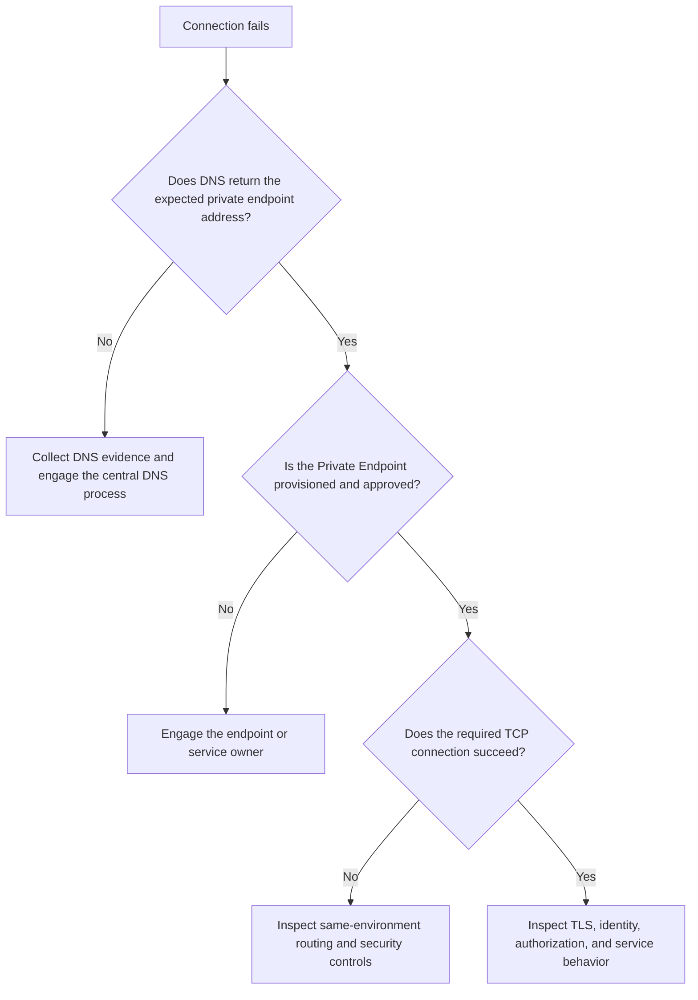

# Troubleshoot Private Connectivity

**Status:** Draft diagnostic guidance. The commands are read-only, but the procedure has not been tested against an organization-specific resource inventory.

**Audience:** Application and platform engineers diagnosing access to an Azure service through a Private Endpoint.

**Owner:** Not yet supplied.

## Problem

A workload or operator cannot resolve or connect to an Azure service that should be reached privately.

## Customer-Safe and Privileged Checks

| Access level | Checks |
| --- | --- |
| Customer-safe | Record the environment and error, resolve the documented service name, and run a non-mutating connection test from an authorized source using existing access. |
| Privileged operator | Inspect Private Endpoint state, Azure activity, effective network configuration, AMPLS membership, or service network settings. Use the designated administrative account and MFA when elevated Azure access is required. |

Stop before a privileged check if the required access is not already authorized. Do not request elevation solely to compare another environment or bypass the documented path.

## Common Symptoms and Likely Causes

| Symptom | Likely cause to investigate first |
| --- | --- |
| `NXDOMAIN` or no DNS answer | Missing record, wrong service name, unavailable DNS path, or missing zone linkage |
| Service name resolves to an unexpected public address | The client is not using the expected private DNS path or the Private Endpoint record is missing |
| Service name resolves privately but TCP times out | Endpoint state, route, network security control, Palo Alto rule, service health, or return path |
| HTTP `403` says public access is disabled | The client reached a public endpoint instead of the intended Private Endpoint path |
| One environment works and another does not | Environment-specific DNS, endpoint, route, policy, or service configuration; environments must not be cross-connected |
| Azure Monitor ingestion or queries fail | AMPLS membership, Private Endpoint, DNS, ingestion access mode, or query access mode |

## Diagnostic Order



Follow the checks from left to right. Do not skip DNS and endpoint state by temporarily enabling public access.

## Before You Begin

- Run tests from an authorized source inside the affected environment.
- Record whether the target is DEV, INT, CRT, or PRD.
- Confirm the expected service hostname and Private Endpoint name without placing secrets in notes.
- Use the designated administrative account and MFA only if elevated read access is required.
- Confirm the active Azure subscription before inspecting resources.

```bash
az account show \
  --query '{Name:name, SubscriptionId:id, TenantId:tenantId}' \
  --output table
```

## Step 1: Check Name Resolution

Run from the affected client or an authorized diagnostic host in the same environment:

```bash
nslookup '<service-fqdn>'
```

If `dig` is available:

```bash
dig +short '<service-fqdn>'
```

Compare the returned address with the configured Private Endpoint address. A private-looking address alone is not proof that it is the correct endpoint.

If the answer is missing or unexpected, collect the client DNS server, queried name, answer, timestamp, and environment. The Cloud Platform Solutions and Services team centrally manages private DNS zones; do not create or change a zone, VNet link, or record as an ad hoc fix.

## Step 2: Inspect the Private Endpoint

**Read-only Azure CLI:**

```bash
az network private-endpoint show \
  --resource-group '<private-endpoint-resource-group>' \
  --name '<private-endpoint-name>' \
  --query '{ProvisioningState:provisioningState, Connections:privateLinkServiceConnections[].privateLinkServiceConnectionState.status, NetworkInterfaces:networkInterfaces[].id, CustomDns:customDnsConfigs[].{Fqdn:fqdn, Addresses:ipAddresses}}' \
  --output jsonc
```

Expected results include a successful provisioning state, an approved connection, and DNS information that agrees with the expected service name and private address. Managed or manual connection collections can differ by service, so review the full resource in the Azure portal if the summarized result is empty.

## Step 3: Test TCP and TLS

Use the port required by the service. HTTPS commonly uses `443`.

**PowerShell:**

```powershell
Test-NetConnection -ComputerName '<service-fqdn>' -Port 443
```

**Bash:**

```bash
curl --head --silent --show-error \
  --connect-timeout 10 \
  'https://<service-fqdn>/'
```

An HTTP authorization error can still prove that DNS, TCP, and TLS succeeded. Do not disable certificate validation or place credentials in the command line merely to obtain a successful application response.

## Step 4: Inspect Same-Environment Network Evidence

If DNS is correct and TCP fails, collect rather than change:

- source subnet and source address
- destination FQDN, private address, and port
- test timestamp and correlation or request identifier, if available
- effective route and network security information available to the source
- recent related Azure activity

```bash
az monitor activity-log list \
  --resource-id '<private-endpoint-or-service-resource-id>' \
  --offset 4h \
  --query '[].{Time:eventTimestamp, Operation:operationName.localizedValue, Status:status.localizedValue}' \
  --output table
```

Cyber Defense Engineering manages the Palo Alto firewall and rules. Do not change routes, network security groups, firewall rules, or environment connections from this guide.

## Step 5: Check the Service Layer

If DNS, endpoint state, TCP, and TLS succeed, investigate:

- identity and role assignment
- service firewall or network access mode
- target subresource and hostname
- application authorization
- service health and throttling
- certificate name and trust
- environment-specific configuration

For Azure Monitor, also verify the target resource's AMPLS membership and the applicable ingestion or query access mode. For APIM, continue with [Troubleshoot Azure API Management](api-management.md).

## Resolution Guardrails

- Do not enable public access to prove that a private path is broken.
- Do not connect environments to reach a dependency in another environment.
- Do not edit centrally managed Private DNS zones without the approved process.
- Do not change Palo Alto rules without Cyber Defense Engineering.
- Use Terraform and the reviewed GitHub Actions workflow for infrastructure corrections unless an approved runbook authorizes another method.
- A resource that genuinely requires public access must complete the [Public Access Exemption Process](../security/public-access-exemption-process.md).

## Validation

After an approved correction, repeat the test from the original affected source and confirm:

- the hostname resolves to the expected Private Endpoint address
- the endpoint is provisioned and approved
- the required port is reachable
- TLS validation succeeds
- the intended operation succeeds with an authorized identity
- no cross-environment connection or public-access bypass was introduced

## Escalation Package

Provide the environment, source type, destination FQDN, expected and observed addresses, port, UTC timestamps, endpoint state, sanitized error, activity-log evidence, impact, and recent-change reference. Do not include tokens, keys, connection strings, private data, or complete sensitive topology exports.

The support channel and escalation ownership for Private Endpoint incidents remain to be documented.

## Official References

- [Microsoft: Troubleshoot private endpoint connectivity failures](https://learn.microsoft.com/troubleshoot/azure/private-link/troubleshoot-private-endpoint-connectivity-failure)
- [Microsoft: Azure Private Endpoint DNS configuration](https://learn.microsoft.com/azure/private-link/private-endpoint-dns)

[Troubleshooting](README.md) | [Private Endpoints](../networking/private-endpoints.md) | [Home](../Home.md)
